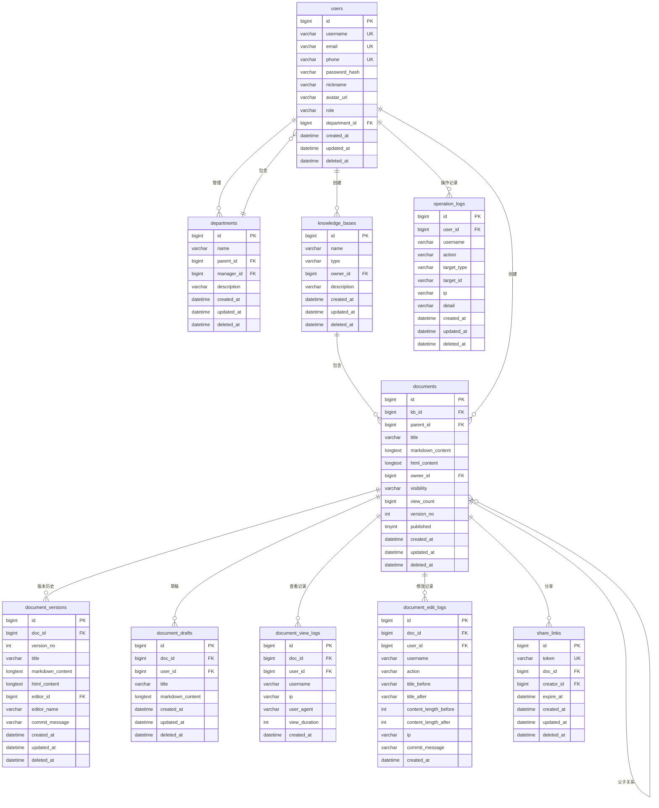
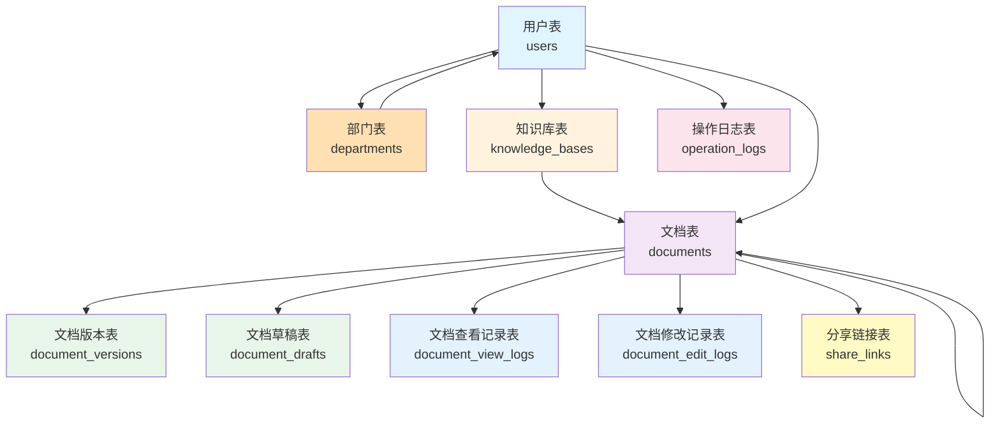
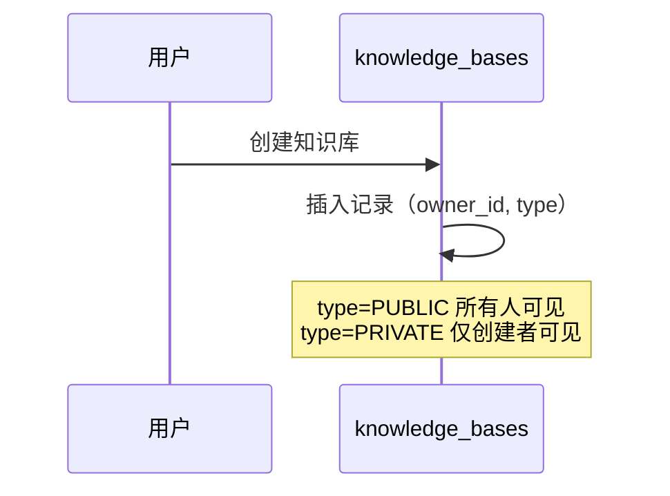
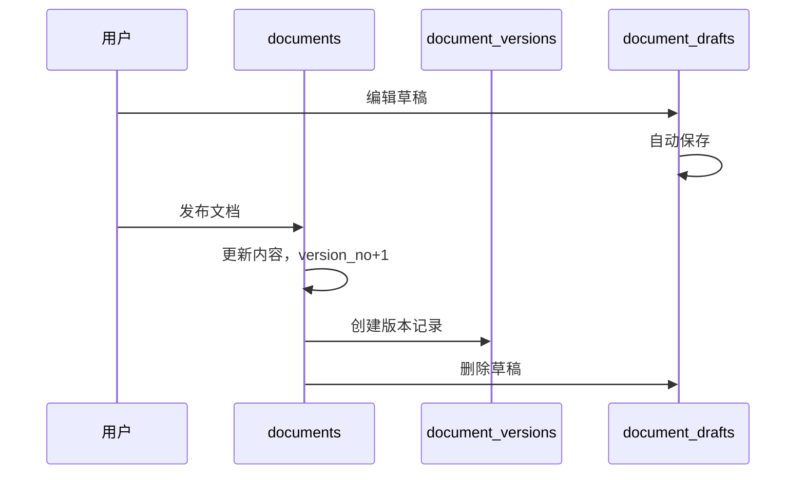
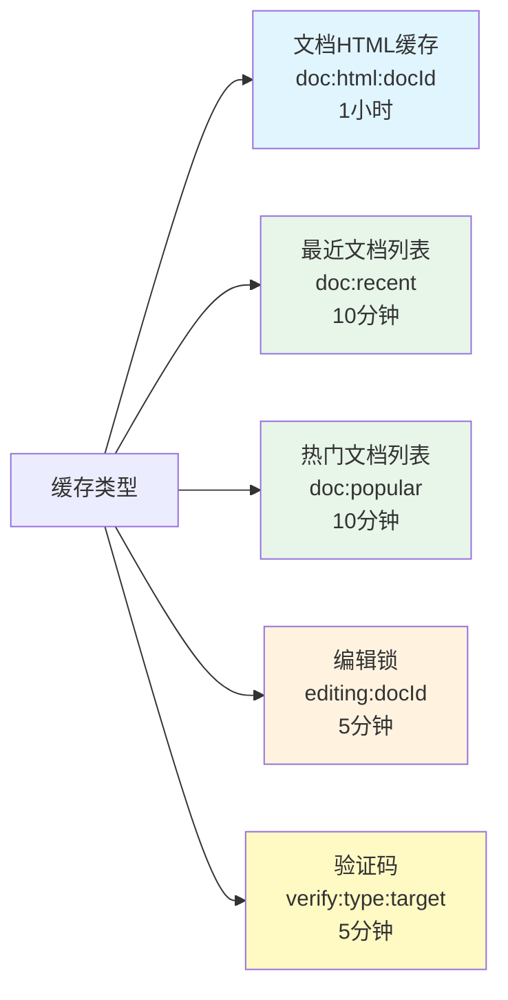
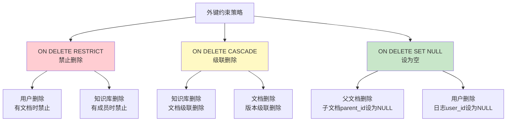
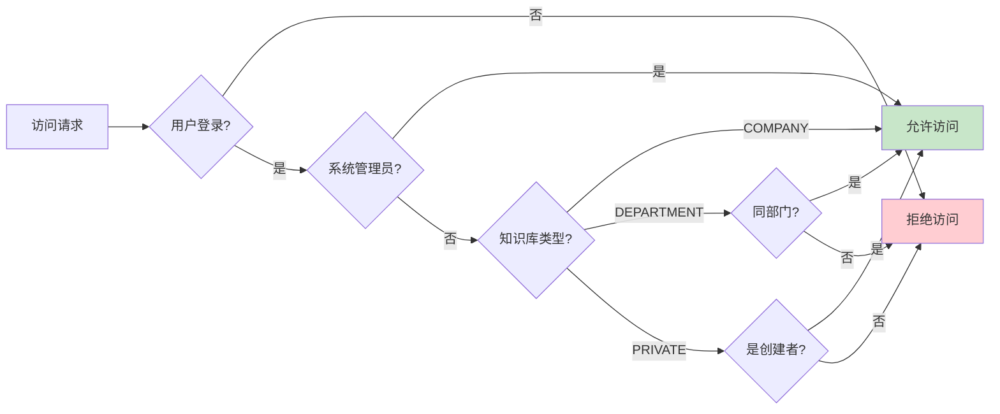

# 企业内部知识库（Wiki）系统 - 数据库设计文档

## 一、概述

### （一）设计目标

本数据库设计旨在支持一个企业内部知识库系统，实现文档的创建、编辑、版本管理、权限控制、协同编辑等功能。数据库设计遵循第三范式，确保数据的一致性和完整性，同时考虑了系统的性能和可扩展性。

### （二）技术选型

- **数据库管理系统**：MySQL 8.0
- **字符集**：utf8mb4（支持完整的 Unicode 字符，包括 emoji）
- **排序规则**：utf8mb4_unicode_ci（不区分大小写）
- **存储引擎**：InnoDB（支持事务和外键约束）

### （三）设计原则

1. 使用雪花算法生成主键 ID（BIGINT 类型），保证分布式环境下的唯一性
2. 采用软删除机制，通过 `deleted_at` 字段标记删除状态
3. 所有表包含 `created_at` 和 `updated_at` 时间戳字段，便于追踪数据变更
4. 合理使用外键约束，保证数据的引用完整性
5. 为常用查询字段建立索引，提高查询性能

---

## 二、数据库表结构设计

### （一）核心表关系

系统主要包含 9 个核心数据表，它们之间的关系如下：

---

### （二）用户表（users）

用户表存储系统所有用户的基本信息和认证信息。

**表结构：**

| 字段名 | 数据类型 | 约束 | 说明 |
|--------|----------|------|------|
| id | BIGINT | PRIMARY KEY | 用户唯一标识（雪花算法生成） |
| username | VARCHAR(64) | NOT NULL, UNIQUE | 用户名，全局唯一 |
| email | VARCHAR(128) | UNIQUE | 邮箱地址，可选但唯一 |
| phone | VARCHAR(32) | UNIQUE | 手机号，可选但唯一 |
| password_hash | VARCHAR(128) | NOT NULL | 密码哈希值（BCrypt 加密） |
| nickname | VARCHAR(64) | NULL | 用户昵称，用于显示 |
| avatar_url | VARCHAR(512) | NULL | 头像 URL |
| role | VARCHAR(16) | NOT NULL | 用户角色（USER/ADMIN） |
| department_id | BIGINT | NULL, FK | 所属部门ID |
| created_at | DATETIME(6) | NOT NULL | 创建时间 |
| updated_at | DATETIME(6) | NOT NULL | 更新时间 |
| deleted_at | DATETIME(6) | NULL | 删除时间（软删除标记） |

**索引设计：**
- PRIMARY KEY: `id`
- UNIQUE KEY: `username`（用户名唯一索引）
- UNIQUE KEY: `email`（邮箱唯一索引）
- UNIQUE KEY: `phone`（手机号唯一索引）
- KEY: `department_id`（部门索引）

**外键约束：**
- `department_id` → `departments(id)`（ON DELETE SET NULL）

**设计说明：**
1. 用户名、邮箱、手机号三者至少需要一个，且全局唯一
2. 密码使用 BCrypt 算法加密存储，不存储明文
3. 角色字段用于区分普通用户和管理员
4. department_id 关联用户所属部门，用于部门知识库权限控制
5. 软删除机制允许用户数据恢复

---

### （三）部门表（departments）

部门表存储企业组织架构信息，支持部门层级结构。

**表结构：**

| 字段名 | 数据类型 | 约束 | 说明 |
|--------|----------|------|------|
| id | BIGINT | PRIMARY KEY | 部门唯一标识（雪花算法生成） |
| name | VARCHAR(128) | NOT NULL | 部门名称 |
| parent_id | BIGINT | NULL, FK | 父部门ID（支持部门层级） |
| manager_id | BIGINT | NULL, FK | 部门部长用户ID |
| description | VARCHAR(512) | NULL | 部门描述 |
| created_at | DATETIME(6) | NOT NULL | 创建时间 |
| updated_at | DATETIME(6) | NOT NULL | 更新时间 |
| deleted_at | DATETIME(6) | NULL | 删除时间（软删除标记） |

**索引设计：**
- PRIMARY KEY: `id`
- KEY: `parent_id`（父部门索引）
- KEY: `manager_id`（部门部长索引）

**外键约束：**
- `parent_id` → `departments(id)`（ON DELETE SET NULL）
- `manager_id` → `users(id)`（ON DELETE SET NULL）

**设计说明：**
1. 支持多级部门层级结构，通过 parent_id 实现
2. manager_id 指定部门部长，部长对部门知识库有管理权限
3. 部门删除时，子部门的 parent_id 设为 NULL
4. 部门部长离职时，manager_id 设为 NULL

---

### （四）知识库表（knowledge_bases）

知识库表存储知识库的基本信息，每个知识库可以包含多个文档。

**表结构：**

| 字段名 | 数据类型 | 约束 | 说明 |
|--------|----------|------|------|
| id | BIGINT | PRIMARY KEY | 知识库唯一标识 |
| name | VARCHAR(128) | NOT NULL | 知识库名称 |
| type | VARCHAR(16) | NOT NULL | 类型（COMPANY/DEPARTMENT/PRIVATE） |
| owner_id | BIGINT | NOT NULL, FK | 创建者用户 ID |
| description | VARCHAR(512) | NULL | 知识库描述 |
| created_at | DATETIME(6) | NOT NULL | 创建时间 |
| updated_at | DATETIME(6) | NOT NULL | 更新时间 |
| deleted_at | DATETIME(6) | NULL | 删除时间 |

**索引设计：**
- PRIMARY KEY: `id`
- KEY: `owner_id`（所有者索引）

**外键约束：**
- `owner_id` → `users(id)`（ON DELETE RESTRICT）

**设计说明：**
1. 知识库类型分为三种（三级权限模型）：
   - COMPANY（公司公开）：全公司所有员工可见、可访问、可编辑
   - DEPARTMENT（部门）：部门内成员可见、可访问、可编辑，部门部长有管理权
   - PRIVATE（私有）：仅创建者可见、可访问、可编辑
2. 创建者不能被删除（RESTRICT 约束）
3. 知识库删除后，相关文档也会被级联删除
4. 权限通过知识库类型、创建者、用户部门关系判断

---

### （五）文档表（documents）

文档表是系统的核心表，存储所有文档的内容和元数据。

**表结构：**

| 字段名 | 数据类型 | 约束 | 说明 |
|--------|----------|------|------|
| id | BIGINT | PRIMARY KEY | 文档唯一标识 |
| kb_id | BIGINT | NOT NULL, FK | 所属知识库 ID |
| parent_id | BIGINT | NULL, FK | 父文档 ID（树形结构） |
| title | VARCHAR(256) | NOT NULL | 文档标题 |
| markdown_content | LONGTEXT | NOT NULL | Markdown 格式内容 |
| html_content | LONGTEXT | NOT NULL | 渲染后的 HTML 内容 |
| owner_id | BIGINT | NOT NULL, FK | 创建者用户 ID |
| visibility | VARCHAR(16) | NOT NULL | 可见性（PUBLIC/TEAM/PRIVATE） |
| view_count | BIGINT | NOT NULL | 浏览次数 |
| version_no | INT | NOT NULL | 当前版本号 |
| published | TINYINT(1) | NOT NULL | 是否已发布 |
| created_at | DATETIME(6) | NOT NULL | 创建时间 |
| updated_at | DATETIME(6) | NOT NULL | 更新时间 |
| deleted_at | DATETIME(6) | NULL | 删除时间 |

**索引设计：**
- PRIMARY KEY: `id`
- KEY: `kb_id`（知识库索引）
- KEY: `parent_id`（父文档索引）
- KEY: `deleted_at`（软删除索引）

**外键约束：**
- `kb_id` → `knowledge_bases(id)`（ON DELETE CASCADE）
- `parent_id` → `documents(id)`（ON DELETE SET NULL）
- `owner_id` → `users(id)`（ON DELETE RESTRICT）

**设计说明：**
1. 文档支持树形结构，通过 `parent_id` 实现父子关系
2. 同时存储 Markdown 和 HTML 两种格式，提高查询性能
3. 版本号用于版本管理，每次发布递增
4. 父文档删除时，子文档的 `parent_id` 设为 NULL

---

### （六）文档版本表（document_versions）

文档版本表记录文档的历史版本，支持版本回溯。

**表结构：**

| 字段名 | 数据类型 | 约束 | 说明 |
|--------|----------|------|------|
| id | BIGINT | PRIMARY KEY | 版本记录唯一标识 |
| doc_id | BIGINT | NOT NULL, FK | 文档 ID |
| version_no | INT | NOT NULL | 版本号 |
| title | VARCHAR(256) | NOT NULL | 文档标题（快照） |
| markdown_content | LONGTEXT | NOT NULL | Markdown 内容（快照） |
| html_content | LONGTEXT | NOT NULL | HTML 内容（快照） |
| editor_id | BIGINT | NOT NULL, FK | 编辑者用户 ID |
| editor_name | VARCHAR(64) | NULL | 编辑者用户名（冗余） |
| commit_message | VARCHAR(256) | NULL | 提交说明 |
| created_at | DATETIME(6) | NOT NULL | 创建时间 |
| updated_at | DATETIME(6) | NOT NULL | 更新时间 |
| deleted_at | DATETIME(6) | NULL | 删除时间 |

**索引设计：**
- PRIMARY KEY: `id`
- KEY: `doc_id`（文档索引）

**外键约束：**
- `doc_id` → `documents(id)`（ON DELETE CASCADE）
- `editor_id` → `users(id)`（ON DELETE RESTRICT）

**设计说明：**
1. 每次文档发布时创建一个版本记录
2. 版本号与文档表的 `version_no` 对应
3. 冗余存储编辑者用户名，避免用户删除后无法显示
4. 文档删除时，版本记录也会被删除

---

### （七）文档草稿表（document_drafts）

文档草稿表存储用户的临时编辑内容，支持自动保存。

**表结构：**

| 字段名 | 数据类型 | 约束 | 说明 |
|--------|----------|------|------|
| id | BIGINT | PRIMARY KEY | 草稿唯一标识 |
| doc_id | BIGINT | NOT NULL, FK | 文档 ID |
| user_id | BIGINT | NOT NULL, FK | 用户 ID |
| title | VARCHAR(256) | NULL | 草稿标题 |
| markdown_content | LONGTEXT | NULL | 草稿内容 |
| created_at | DATETIME(6) | NOT NULL | 创建时间 |
| updated_at | DATETIME(6) | NOT NULL | 更新时间 |
| deleted_at | DATETIME(6) | NULL | 删除时间 |

**索引设计：**
- PRIMARY KEY: `id`
- UNIQUE KEY: `(doc_id, user_id)`（联合唯一索引）

**外键约束：**
- `doc_id` → `documents(id)`（ON DELETE CASCADE）
- `user_id` → `users(id)`（ON DELETE CASCADE）

**设计说明：**
1. 每个用户对每个文档只保留一份草稿
2. 草稿内容可以为空（初次创建时）
3. 文档或用户删除时，草稿自动删除
4. 系统会定期清理超过 30 天未更新的草稿

---

### （八）文档查看记录表（document_view_logs）

文档查看记录表记录用户对文档的查看行为，用于统计分析和审计。

**表结构：**

| 字段名 | 数据类型 | 约束 | 说明 |
|--------|----------|------|------|
| id | BIGINT | PRIMARY KEY | 记录唯一标识（雪花算法生成） |
| doc_id | BIGINT | NOT NULL, FK | 文档ID |
| user_id | BIGINT | NOT NULL, FK | 查看用户ID |
| username | VARCHAR(64) | NULL | 用户名（冗余） |
| ip | VARCHAR(64) | NULL | IP地址 |
| user_agent | VARCHAR(512) | NULL | 用户代理（浏览器信息） |
| view_duration | INT | NULL | 查看时长（秒） |
| created_at | DATETIME(6) | NOT NULL | 查看时间 |

**索引设计：**
- PRIMARY KEY: `id`
- KEY: `doc_id`（文档索引）
- KEY: `user_id`（用户索引）
- KEY: `created_at`（时间索引）

**外键约束：**
- `doc_id` → `documents(id)`（ON DELETE CASCADE）
- `user_id` → `users(id)`（ON DELETE SET NULL）

**设计说明：**
1. 记录每次文档查看行为，包含查看者、时间、IP等信息
2. user_agent 用于分析用户使用的浏览器和设备
3. view_duration 可用于统计用户阅读时长
4. 文档删除时，查看记录也会被删除
5. 用户删除时，查看记录保留但 user_id 设为 NULL
6. **数据保留策略**：为避免数据膨胀，系统会自动清理超过 15 天的查看记录

---

### （九）文档修改记录表（document_edit_logs）

文档修改记录表记录文档的所有修改操作，用于审计和追溯。

**表结构：**

| 字段名 | 数据类型 | 约束 | 说明 |
|--------|----------|------|------|
| id | BIGINT | PRIMARY KEY | 记录唯一标识（雪花算法生成） |
| doc_id | BIGINT | NOT NULL, FK | 文档ID |
| user_id | BIGINT | NOT NULL, FK | 修改用户ID |
| username | VARCHAR(64) | NULL | 用户名（冗余） |
| action | VARCHAR(32) | NOT NULL | 操作类型（CREATE/UPDATE/DELETE/PUBLISH） |
| title_before | VARCHAR(256) | NULL | 修改前标题 |
| title_after | VARCHAR(256) | NULL | 修改后标题 |
| content_length_before | INT | NULL | 修改前内容长度 |
| content_length_after | INT | NULL | 修改后内容长度 |
| ip | VARCHAR(64) | NULL | IP地址 |
| commit_message | VARCHAR(256) | NULL | 提交说明 |
| created_at | DATETIME(6) | NOT NULL | 修改时间 |

**索引设计：**
- PRIMARY KEY: `id`
- KEY: `doc_id`（文档索引）
- KEY: `user_id`（用户索引）
- KEY: `created_at`（时间索引）
- KEY: `action`（操作类型索引）

**外键约束：**
- `doc_id` → `documents(id)`（ON DELETE CASCADE）
- `user_id` → `users(id)`（ON DELETE SET NULL）

**设计说明：**
1. 记录文档的创建、更新、删除等所有修改操作
2. 记录修改前后的标题和内容长度变化，便于追溯
3. action 字段标识操作类型：CREATE（创建）、UPDATE（更新）、DELETE（删除）、PUBLISH（发布）
4. commit_message 记录用户提交时的说明信息
5. 文档删除时，修改记录也会被删除
6. 用户删除时，修改记录保留但 user_id 设为 NULL
7. **数据保留策略**：为避免数据膨胀，系统会自动清理超过 15 天的修改记录

---

### （十）分享链接表（share_links）

分享链接表存储文档的公开分享链接信息。

**表结构：**

| 字段名 | 数据类型 | 约束 | 说明 |
|--------|----------|------|------|
| id | BIGINT | PRIMARY KEY | 分享链接唯一标识 |
| token | VARCHAR(64) | NOT NULL, UNIQUE | 分享令牌（随机生成） |
| doc_id | BIGINT | NOT NULL, FK | 文档 ID |
| creator_id | BIGINT | NOT NULL, FK | 创建者用户 ID |
| expire_at | DATETIME(6) | NULL | 过期时间（NULL 表示永久） |
| created_at | DATETIME(6) | NOT NULL | 创建时间 |
| updated_at | DATETIME(6) | NOT NULL | 更新时间 |
| deleted_at | DATETIME(6) | NULL | 删除时间（撤销分享） |

**索引设计：**
- PRIMARY KEY: `id`
- UNIQUE KEY: `token`（令牌唯一索引）
- KEY: `doc_id`（文档索引）

**外键约束：**
- `doc_id` → `documents(id)`（ON DELETE CASCADE）
- `creator_id` → `users(id)`（ON DELETE CASCADE）

**设计说明：**
1. 使用随机令牌作为分享链接的标识
2. 支持设置过期时间，NULL 表示永久有效
3. 软删除机制用于撤销分享
4. 文档删除时，分享链接自动失效

---

### （十一）操作日志表（operation_logs）

操作日志表记录系统的重要操作，用于审计和追溯。

**表结构：**

| 字段名 | 数据类型 | 约束 | 说明 |
|--------|----------|------|------|
| id | BIGINT | PRIMARY KEY | 日志唯一标识 |
| user_id | BIGINT | NULL, FK | 操作用户 ID |
| username | VARCHAR(64) | NULL | 操作用户名（冗余） |
| action | VARCHAR(64) | NULL | 操作类型 |
| target_type | VARCHAR(64) | NULL | 目标类型 |
| target_id | VARCHAR(64) | NULL | 目标 ID |
| ip | VARCHAR(64) | NULL | 操作 IP 地址 |
| detail | VARCHAR(1024) | NULL | 详细信息 |
| created_at | DATETIME(6) | NOT NULL | 操作时间 |
| updated_at | DATETIME(6) | NOT NULL | 更新时间 |
| deleted_at | DATETIME(6) | NULL | 删除时间 |

**索引设计：**
- PRIMARY KEY: `id`
- KEY: `created_at`（时间索引）
- KEY: `user_id`（用户索引）

**外键约束：**
- `user_id` → `users(id)`（ON DELETE SET NULL）

**设计说明：**
1. 记录登录、删除、权限变更等关键操作
2. 用户删除后，日志保留但 `user_id` 设为 NULL
3. 冗余存储用户名，确保日志可读性
4. 支持按时间、用户、操作类型等维度查询

---

## 三、数据库关系图

### （一）表关系概览

### （二）核心业务流程

**1. 用户创建知识库流程**

**2. 文档发布流程**

---

## 四、缓存设计

为了提高系统性能，使用 Redis 缓存热点数据。

### （一）缓存策略

### （二）缓存键设计

| 缓存类型 | 键格式 | 过期时间 | 说明 |
|----------|--------|----------|------|
| 文档 HTML | `doc:html:{docId}` | 1 小时 | 渲染后的 HTML 内容 |
| 最近文档 | `doc:recent:{userId}` | 10 分钟 | 用户最近访问的文档列表 |
| 热门文档 | `doc:popular:{kbId}` | 10 分钟 | 知识库热门文档列表 |
| 编辑锁 | `editing:{docId}` | 5 分钟 | 文档编辑锁 |
| 验证码 | `verify:{type}:{target}` | 5 分钟 | 邮箱/手机验证码 |

### （三）缓存更新策略

1. **文档更新时**：删除对应的 HTML 缓存和列表缓存
2. **文档删除时**：清理所有相关缓存
3. **缓存热点数据**：使用 Redis 缓存常用数据
4. **定时任务**：每小时更新热门文档列表
5. **日志清理**：每天凌晨 3 点自动清理超过 15 天的查看和修改记录

---

## 五、索引优化

### （一）索引设计原则

1. 为外键字段建立索引，提高关联查询性能
2. 为常用查询条件建立索引（如 `deleted_at`）
3. 为唯一性约束建立唯一索引
4. 避免过多索引，平衡查询和写入性能

### （二）主要索引列表

| 表名 | 索引类型 | 索引字段 | 用途 |
|------|----------|----------|------|
| users | UNIQUE | username | 用户名唯一性 |
| users | UNIQUE | email | 邮箱唯一性 |
| users | UNIQUE | phone | 手机号唯一性 |
| departments | INDEX | parent_id | 查询子部门 |
| departments | INDEX | manager_id | 查询部门部长管理的部门 |
| users | INDEX | department_id | 查询部门成员 |
| knowledge_bases | INDEX | owner_id | 查询用户创建的知识库 |
| knowledge_bases | INDEX | type | 查询特定类型知识库 |
| documents | INDEX | kb_id | 查询知识库下的文档 |
| document_view_logs | INDEX | doc_id | 查询文档查看记录 |
| document_view_logs | INDEX | user_id | 查询用户查看记录 |
| document_view_logs | INDEX | created_at | 按时间查询查看记录 |
| document_edit_logs | INDEX | doc_id | 查询文档修改记录 |
| document_edit_logs | INDEX | user_id | 查询用户修改记录 |
| document_edit_logs | INDEX | created_at | 按时间查询修改记录 |
| document_edit_logs | INDEX | action | 按操作类型查询 |
| documents | INDEX | parent_id | 查询子文档 |
| documents | INDEX | deleted_at | 过滤已删除文档 |
| document_versions | INDEX | doc_id | 查询文档版本历史 |
| document_drafts | UNIQUE | (doc_id, user_id) | 每个用户一份草稿 |
| share_links | UNIQUE | token | 通过令牌查询分享链接 |
| share_links | INDEX | doc_id | 查询文档的分享链接 |
| operation_logs | INDEX | created_at | 按时间查询日志 |
| operation_logs | INDEX | user_id | 查询用户操作日志 |

---

## 六、数据完整性约束

### （一）外键约束策略

### （二）约束规则说明

| 父表 | 子表 | 外键字段 | 删除策略 | 说明 |
|------|------|----------|----------|------|
| departments | departments | parent_id | SET NULL | 父部门删除时子部门移到根级 |
| departments | users | department_id | SET NULL | 部门删除时用户部门字段清空 |
| users | departments | manager_id | SET NULL | 部门部长离职时部长字段清空 |
| users | knowledge_bases | owner_id | RESTRICT | 用户有知识库时不能删除 |
| users | documents | owner_id | RESTRICT | 用户有文档时不能删除 |
| users | document_versions | editor_id | RESTRICT | 保留版本历史 |
| users | document_view_logs | user_id | SET NULL | 用户删除后查看记录保留 |
| users | document_edit_logs | user_id | SET NULL | 用户删除后修改记录保留 |
| users | operation_logs | user_id | SET NULL | 用户删除后日志保留 |
| knowledge_bases | documents | kb_id | CASCADE | 知识库删除时文档一起删除 |
| documents | document_versions | doc_id | CASCADE | 文档删除时版本一起删除 |
| documents | document_drafts | doc_id | CASCADE | 文档删除时草稿一起删除 |
| documents | document_view_logs | doc_id | CASCADE | 文档删除时查看记录一起删除 |
| documents | document_edit_logs | doc_id | CASCADE | 文档删除时修改记录一起删除 |
| documents | share_links | doc_id | CASCADE | 文档删除时分享链接失效 |
| documents | documents | parent_id | SET NULL | 父文档删除时子文档移到根目录 |

---

## 七、数据安全设计

### （一）敏感数据保护

1. **密码加密**：使用 BCrypt 算法加密，不存储明文
2. **软删除机制**：重要数据不物理删除，通过 `deleted_at` 标记
3. **操作日志**：记录关键操作，便于审计和追溯

### （二）权限控制

### （三）数据备份策略

1. **全量备份**：每天凌晨 2 点自动备份
2. **增量备份**：每 6 小时备份一次
3. **备份保留**：保留最近 30 天的备份
4. **异地备份**：定期同步到异地服务器

---

## 八、性能优化建议

### （一）查询优化

1. **使用索引**：为常用查询字段建立索引
2. **避免全表扫描**：使用 WHERE 条件过滤
3. **分页查询**：大数据量查询使用 LIMIT 分页
4. **缓存热点数据**：使用 Redis 缓存常用数据

### （二）写入优化

1. **批量插入**：使用批量插入减少数据库连接次数
2. **异步处理**：非关键操作使用异步处理
3. **事务控制**：合理使用事务，避免长事务

### （三）存储优化

1. **定期清理**：
   - 清理超过 30 天的草稿和回收站数据
   - **自动清理日志记录**：每天凌晨 3 点自动清理超过 15 天的查看记录和修改记录，避免数据膨胀
2. **归档历史数据**：将旧版本数据归档到历史表
3. **压缩存储**：对大文本字段考虑压缩存储

### （四）日志数据管理

为避免日志数据无限增长导致数据库性能下降和存储空间耗尽，系统实施以下日志管理策略：

1. **日志保留期限**：
   - 文档查看记录（document_view_logs）：保留 15 天
   - 文档修改记录（document_edit_logs）：保留 15 天
   - 操作日志（operation_logs）：保留 90 天（用于安全审计）

2. **自动清理机制**：
   - 定时任务每天凌晨 3 点执行清理
   - 使用批量删除操作，避免影响数据库性能
   - 清理操作记录到系统日志，便于监控

3. **日志查询优化**：
   - created_at 字段建立索引，提高按时间范围查询的性能
   - 支持分页查询，避免一次性加载大量数据
   - 提供统计聚合接口，减少明细数据查询
3. **压缩存储**：对大文本字段考虑压缩存储

---

## 九、扩展性设计

### （一）水平扩展

1. **读写分离**：主库写入，从库读取
2. **分库分表**：按知识库 ID 分表，提高并发能力
3. **缓存集群**：Redis 集群部署，提高缓存容量

### （二）功能扩展

1. **预留字段**：部分表预留扩展字段
2. **插件机制**：支持第三方插件扩展
3. **API 接口**：提供标准 RESTful API

---

## 十、总结

本数据库设计遵循了规范化原则，合理使用了外键约束和索引优化，同时考虑了系统的性能、安全性和可扩展性。主要特点包括：

1. **规范化设计**：符合第三范式，减少数据冗余
2. **软删除机制**：重要数据可恢复，提高数据安全性
3. **完整性约束**：使用外键保证数据一致性
4. **性能优化**：合理使用索引和缓存，提高查询效率
5. **可扩展性**：支持水平扩展和功能扩展

该设计能够满足企业内部知识库系统的功能需求，同时具备良好的性能和可维护性。