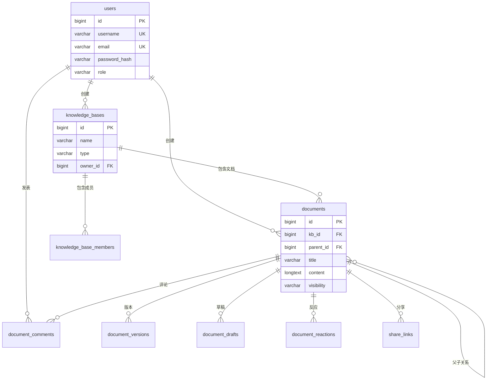

# 企业内部知识库（Wiki）系统 - 数据库设计文档

## 一、概述

### （一）设计目标

本数据库设计支持企业内部知识库系统，实现文档的创建、编辑、版本管理、权限控制、协同编辑等功能。设计遵循第三范式，确保数据的一致性和完整性。

### （二）技术选型

- **数据库管理系统**：MySQL 8.0
- **字符集**：utf8mb4
- **排序规则**：utf8mb4_unicode_ci
- **存储引擎**：InnoDB

### （三）设计原则

1. 使用雪花算法生成主键ID（BIGINT类型）
2. 采用软删除机制，通过deleted_at字段标记删除状态
3. 所有表包含created_at和updated_at时间戳字段
4. 合理使用外键约束，保证数据的引用完整性
5. 为常用查询字段建立索引

## 二、数据表设计

### （一）用户表（users）

存储系统所有用户的基本信息和认证信息。

| 字段名 | 数据类型 | 约束 | 说明 |
|--------|----------|------|------|
| id | BIGINT | PRIMARY KEY | 用户唯一标识 |
| username | VARCHAR(64) | NOT NULL, UNIQUE | 用户名 |
| email | VARCHAR(128) | UNIQUE | 邮箱地址 |
| phone | VARCHAR(32) | UNIQUE | 手机号 |
| password_hash | VARCHAR(128) | NOT NULL | 密码哈希值 |
| nickname | VARCHAR(64) | NULL | 用户昵称 |
| avatar_url | VARCHAR(512) | NULL | 头像URL |
| role | VARCHAR(16) | NOT NULL | 用户角色（USER/ADMIN） |
| created_at | DATETIME(6) | NOT NULL | 创建时间 |
| updated_at | DATETIME(6) | NOT NULL | 更新时间 |
| deleted_at | DATETIME(6) | NULL | 删除时间 |

**索引：**
- PRIMARY KEY: id
- UNIQUE KEY: username
- UNIQUE KEY: email
- UNIQUE KEY: phone

### （二）知识库表（knowledge_bases）

存储知识库的基本信息。

| 字段名 | 数据类型 | 约束 | 说明 |
|--------|----------|------|------|
| id | BIGINT | PRIMARY KEY | 知识库唯一标识 |
| name | VARCHAR(128) | NOT NULL | 知识库名称 |
| type | VARCHAR(16) | NOT NULL | 类型（PUBLIC/PRIVATE/TEAM） |
| owner_id | BIGINT | NOT NULL, FK | 创建者用户ID |
| description | VARCHAR(512) | NULL | 知识库描述 |
| created_at | DATETIME(6) | NOT NULL | 创建时间 |
| updated_at | DATETIME(6) | NOT NULL | 更新时间 |
| deleted_at | DATETIME(6) | NULL | 删除时间 |

**索引：**
- PRIMARY KEY: id
- KEY: owner_id

**外键：**
- owner_id → users(id) (ON DELETE RESTRICT)

### （三）知识库成员表（knowledge_base_members）

存储知识库的成员关系和权限。

| 字段名 | 数据类型 | 约束 | 说明 |
|--------|----------|------|------|
| id | BIGINT | PRIMARY KEY | 记录唯一标识 |
| kb_id | BIGINT | NOT NULL, FK | 知识库ID |
| user_id | BIGINT | NOT NULL, FK | 用户ID |
| role | VARCHAR(16) | NOT NULL | 角色（OWNER/ADMIN/EDITOR/VIEWER） |
| created_at | DATETIME(6) | NOT NULL | 创建时间 |
| updated_at | DATETIME(6) | NOT NULL | 更新时间 |
| deleted_at | DATETIME(6) | NULL | 删除时间 |

**索引：**
- PRIMARY KEY: id
- UNIQUE KEY: (kb_id, user_id)
- KEY: kb_id
- KEY: user_id

**外键：**
- kb_id → knowledge_bases(id) (ON DELETE CASCADE)
- user_id → users(id) (ON DELETE CASCADE)

### （四）文档表（documents）

存储所有文档的内容和元数据。

| 字段名 | 数据类型 | 约束 | 说明 |
|--------|----------|------|------|
| id | BIGINT | PRIMARY KEY | 文档唯一标识 |
| kb_id | BIGINT | NOT NULL, FK | 所属知识库ID |
| parent_id | BIGINT | NULL, FK | 父文档ID |
| title | VARCHAR(256) | NOT NULL | 文档标题 |
| markdown_content | LONGTEXT | NOT NULL | Markdown格式内容 |
| html_content | LONGTEXT | NOT NULL | 渲染后的HTML内容 |
| owner_id | BIGINT | NOT NULL, FK | 创建者用户ID |
| visibility | VARCHAR(16) | NOT NULL | 可见性（PUBLIC/TEAM/PRIVATE） |
| view_count | BIGINT | NOT NULL | 浏览次数 |
| version_no | INT | NOT NULL | 当前版本号 |
| published | TINYINT(1) | NOT NULL | 是否已发布 |
| created_at | DATETIME(6) | NOT NULL | 创建时间 |
| updated_at | DATETIME(6) | NOT NULL | 更新时间 |
| deleted_at | DATETIME(6) | NULL | 删除时间 |

**索引：**
- PRIMARY KEY: id
- KEY: kb_id
- KEY: parent_id
- KEY: deleted_at

**外键：**
- kb_id → knowledge_bases(id) (ON DELETE CASCADE)
- parent_id → documents(id) (ON DELETE SET NULL)
- owner_id → users(id) (ON DELETE RESTRICT)

### （五）文档版本表（document_versions）

记录文档的历史版本。

| 字段名 | 数据类型 | 约束 | 说明 |
|--------|----------|------|------|
| id | BIGINT | PRIMARY KEY | 版本记录唯一标识 |
| doc_id | BIGINT | NOT NULL, FK | 文档ID |
| version_no | INT | NOT NULL | 版本号 |
| title | VARCHAR(256) | NOT NULL | 文档标题 |
| markdown_content | LONGTEXT | NOT NULL | Markdown内容 |
| html_content | LONGTEXT | NOT NULL | HTML内容 |
| editor_id | BIGINT | NOT NULL, FK | 编辑者用户ID |
| editor_name | VARCHAR(64) | NULL | 编辑者用户名 |
| commit_message | VARCHAR(256) | NULL | 提交说明 |
| created_at | DATETIME(6) | NOT NULL | 创建时间 |
| updated_at | DATETIME(6) | NOT NULL | 更新时间 |
| deleted_at | DATETIME(6) | NULL | 删除时间 |

**索引：**
- PRIMARY KEY: id
- KEY: doc_id

**外键：**
- doc_id → documents(id) (ON DELETE CASCADE)
- editor_id → users(id) (ON DELETE RESTRICT)

### （六）文档草稿表（document_drafts）

存储用户的临时编辑内容。

| 字段名 | 数据类型 | 约束 | 说明 |
|--------|----------|------|------|
| id | BIGINT | PRIMARY KEY | 草稿唯一标识 |
| doc_id | BIGINT | NOT NULL, FK | 文档ID |
| user_id | BIGINT | NOT NULL, FK | 用户ID |
| title | VARCHAR(256) | NULL | 草稿标题 |
| markdown_content | LONGTEXT | NULL | 草稿内容 |
| created_at | DATETIME(6) | NOT NULL | 创建时间 |
| updated_at | DATETIME(6) | NOT NULL | 更新时间 |
| deleted_at | DATETIME(6) | NULL | 删除时间 |

**索引：**
- PRIMARY KEY: id
- UNIQUE KEY: (doc_id, user_id)

**外键：**
- doc_id → documents(id) (ON DELETE CASCADE)
- user_id → users(id) (ON DELETE CASCADE)

### （七）文档模板表（document_templates）

存储文档模板信息。

| 字段名 | 数据类型 | 约束 | 说明 |
|--------|----------|------|------|
| id | BIGINT | PRIMARY KEY | 模板唯一标识 |
| name | VARCHAR(128) | NOT NULL | 模板名称 |
| description | VARCHAR(512) | NULL | 模板描述 |
| kb_id | BIGINT | NULL, FK | 所属知识库ID |
| creator_id | BIGINT | NOT NULL, FK | 创建者ID |
| markdown_content | LONGTEXT | NULL | 模板内容 |
| is_public | BOOLEAN | NOT NULL | 是否公开 |
| use_count | INT | NOT NULL | 使用次数 |
| category | VARCHAR(64) | NULL | 分类 |
| cover_url | VARCHAR(512) | NULL | 封面URL |
| created_at | TIMESTAMP | NOT NULL | 创建时间 |
| updated_at | TIMESTAMP | NOT NULL | 更新时间 |
| deleted_at | TIMESTAMP | NULL | 删除时间 |

**索引：**
- PRIMARY KEY: id
- KEY: kb_id
- KEY: creator_id

### （八）文档评论表（document_comments）

存储文档的评论和回复。

| 字段名 | 数据类型 | 约束 | 说明 |
|--------|----------|------|------|
| id | BIGINT | PRIMARY KEY | 评论唯一标识 |
| document_id | BIGINT | NOT NULL, FK | 文档ID |
| author_id | BIGINT | NOT NULL, FK | 作者ID |
| parent_id | BIGINT | NULL, FK | 父评论ID |
| content | TEXT | NOT NULL | 评论内容 |
| like_count | INT | NOT NULL | 点赞数 |
| is_resolved | BOOLEAN | NOT NULL | 是否已解决 |
| resolved_by | BIGINT | NULL, FK | 解决者ID |
| resolved_at | TIMESTAMP | NULL | 解决时间 |
| created_at | TIMESTAMP | NOT NULL | 创建时间 |
| updated_at | TIMESTAMP | NOT NULL | 更新时间 |
| deleted_at | TIMESTAMP | NULL | 删除时间 |

**索引：**
- PRIMARY KEY: id
- KEY: document_id
- KEY: author_id
- KEY: parent_id

### （九）文档反应表（document_reactions）

存储用户对文档的表情反应。

| 字段名 | 数据类型 | 约束 | 说明 |
|--------|----------|------|------|
| id | BIGINT | PRIMARY KEY | 反应唯一标识 |
| document_id | BIGINT | NOT NULL, FK | 文档ID |
| user_id | BIGINT | NOT NULL, FK | 用户ID |
| reaction_type | VARCHAR(32) | NOT NULL | 反应类型 |
| created_at | TIMESTAMP | NOT NULL | 创建时间 |
| updated_at | TIMESTAMP | NOT NULL | 更新时间 |
| deleted_at | TIMESTAMP | NULL | 删除时间 |

**索引：**
- PRIMARY KEY: id
- KEY: document_id
- KEY: user_id
- UNIQUE KEY: (document_id, user_id, reaction_type)

### （十）分享链接表（share_links）

存储文档的公开分享链接信息。

| 字段名 | 数据类型 | 约束 | 说明 |
|--------|----------|------|------|
| id | BIGINT | PRIMARY KEY | 分享链接唯一标识 |
| token | VARCHAR(64) | NOT NULL, UNIQUE | 分享令牌 |
| doc_id | BIGINT | NOT NULL, FK | 文档ID |
| creator_id | BIGINT | NOT NULL, FK | 创建者用户ID |
| expire_at | DATETIME(6) | NULL | 过期时间 |
| created_at | DATETIME(6) | NOT NULL | 创建时间 |
| updated_at | DATETIME(6) | NOT NULL | 更新时间 |
| deleted_at | DATETIME(6) | NULL | 删除时间 |

**索引：**
- PRIMARY KEY: id
- UNIQUE KEY: token
- KEY: doc_id

**外键：**
- doc_id → documents(id) (ON DELETE CASCADE)
- creator_id → users(id) (ON DELETE CASCADE)

### （十一）操作日志表（operation_logs）

记录系统的重要操作。

| 字段名 | 数据类型 | 约束 | 说明 |
|--------|----------|------|------|
| id | BIGINT | PRIMARY KEY | 日志唯一标识 |
| user_id | BIGINT | NULL, FK | 操作用户ID |
| username | VARCHAR(64) | NULL | 操作用户名 |
| action | VARCHAR(64) | NULL | 操作类型 |
| target_type | VARCHAR(64) | NULL | 目标类型 |
| target_id | VARCHAR(64) | NULL | 目标ID |
| ip | VARCHAR(64) | NULL | 操作IP地址 |
| detail | VARCHAR(1024) | NULL | 详细信息 |
| created_at | DATETIME(6) | NOT NULL | 操作时间 |
| updated_at | DATETIME(6) | NOT NULL | 更新时间 |
| deleted_at | DATETIME(6) | NULL | 删除时间 |

**索引：**
- PRIMARY KEY: id
- KEY: created_at
- KEY: user_id

**外键：**
- user_id → users(id) (ON DELETE SET NULL)

## 三、数据库关系

### （一）表关系图

```mermaid
erDiagram
    users ||--o{ knowledge_bases : "创建"
    users ||--o{ documents : "创建"
    users ||--o{ document_comments : "发表"

    knowledge_bases ||--o{ knowledge_base_members : "包含成员"
    knowledge_bases ||--o{ documents : "包含文档"

    documents ||--o{ documents : "父子关系"
    documents ||--o{ document_versions : "版本"
    documents ||--o{ document_drafts : "草稿"
    documents ||--o{ document_comments : "评论"
    documents ||--o{ document_reactions : "反应"
    documents ||--o{ share_links : "分享"

    users {
        bigint id PK
        varchar username UK
        varchar email UK
        varchar password_hash
        varchar role
    }

    knowledge_bases {
        bigint id PK
        varchar name
        varchar type
        bigint owner_id FK
    }

    documents {
        bigint id PK
        bigint kb_id FK
        bigint parent_id FK
        varchar title
        longtext content
        varchar visibility
    }
```

### （二）外键约束策略

| 父表 | 子表 | 外键字段 | 删除策略 | 说明 |
|------|------|----------|----------|------|
| users | knowledge_bases | owner_id | RESTRICT | 用户有知识库时不能删除 |
| users | documents | owner_id | RESTRICT | 用户有文档时不能删除 |
| users | operation_logs | user_id | SET NULL | 用户删除后日志保留 |
| knowledge_bases | documents | kb_id | CASCADE | 知识库删除时文档一起删除 |
| documents | document_versions | doc_id | CASCADE | 文档删除时版本一起删除 |
| documents | document_drafts | doc_id | CASCADE | 文档删除时草稿一起删除 |
| documents | share_links | doc_id | CASCADE | 文档删除时分享链接失效 |
| documents | documents | parent_id | SET NULL | 父文档删除时子文档移到根目录 |

## 四、缓存设计

### （一）Redis缓存策略

| 缓存类型 | 键格式 | 过期时间 | 说明 |
|----------|--------|----------|------|
| 文档HTML | doc:html:{docId} | 1小时 | 渲染后的HTML内容 |
| 最近文档 | doc:recent:{userId} | 10分钟 | 用户最近访问的文档列表 |
| 热门文档 | doc:popular:{kbId} | 10分钟 | 知识库热门文档列表 |
| 编辑锁 | editing:{docId} | 5分钟 | 文档编辑锁 |
| 验证码 | verify:{type}:{target} | 5分钟 | 邮箱/手机验证码 |

### （二）缓存更新策略

1. 文档更新时：删除对应的HTML缓存和列表缓存
2. 文档删除时：清理所有相关缓存
3. 定时任务：每小时更新热门文档列表

## 五、性能优化

### （一）索引优化

为常用查询字段建立索引：

- 外键字段建立索引
- 唯一性约束建立唯一索引
- 常用查询条件建立索引（如deleted_at）

### （二）查询优化

1. 使用索引避免全表扫描
2. 使用分页查询处理大数据量
3. 使用Redis缓存热点数据
4. 合理使用事务，避免长事务

### （三）存储优化

1. 定期清理超过30天的草稿和回收站数据
2. 归档历史版本数据
3. 对大文本字段考虑压缩存储

## 六、总结

本数据库设计遵循了规范化原则，合理使用了外键约束和索引优化，同时考虑了系统的性能、安全性和可扩展性。设计能够满足企业内部知识库系统的功能需求，具备良好的性能和可维护性。
