# 系统架构设计文档

## 一、文档概述

### 1.1 文档目的

本文档旨在描述Wiki知识管理系统的整体架构设计，包括系统的技术选型、架构模式、模块划分、数据流转等内容，为系统的开发、测试和维护提供技术指导。

### 1.2 项目背景

Wiki知识管理系统是一个支持多人协作的在线文档编辑平台，用户可以创建知识库、编写Markdown文档、实时协作编辑，并通过分享链接将文档分享给他人。系统采用前后端分离架构，提供了完整的用户认证、权限管理、版本控制等功能。

### 1.3 术语说明

- **知识库（KB）**：用户创建的文档集合容器
- **文档（Document）**：知识库中的Markdown文档
- **草稿（Draft）**：文档的自动保存副本
- **协作房间（Collab Room）**：支持多人实时编辑的WebSocket会话空间
- **OT算法**：操作转换（Operational Transformation）算法，用于解决协作冲突

---

## 二、系统架构概述

### 2.1 总体架构

系统采用经典的前后端分离架构，前端使用Vue 3构建单页应用，后端使用Spring Boot提供RESTful API和WebSocket服务。

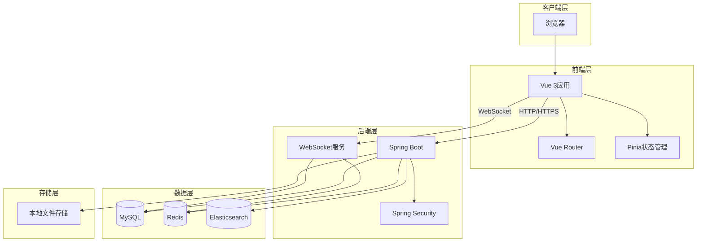

### 2.2 技术栈选型

#### 2.2.1 前端技术栈

| 技术 | 版本 | 用途 |
|------|------|------|
| Vue | 3.5.12 | 前端框架，使用Composition API |
| Vue Router | 4.4.5 | 路由管理 |
| Pinia | 2.2.4 | 状态管理 |
| Vite | 5.4.8 | 构建工具 |
| Axios | 1.7.7 | HTTP客户端 |
| Marked | 14.1.2 | Markdown渲染 |

#### 2.2.2 后端技术栈

| 技术 | 版本 | 用途 |
|------|------|------|
| Spring Boot | 3.3.5 | 后端框架 |
| Spring Data JPA | - | ORM框架 |
| Spring Security | - | 认证授权 |
| Spring WebSocket | - | 实时协作 |
| MySQL | - | 关系型数据库 |
| Redis | - | 缓存 |
| Elasticsearch | - | 全文搜索（可选） |
| JWT | - | 令牌认证 |

---

## 三、系统架构设计

### 3.1 分层架构

系统采用经典的三层架构模式，从上到下分为表现层、业务逻辑层和数据访问层。

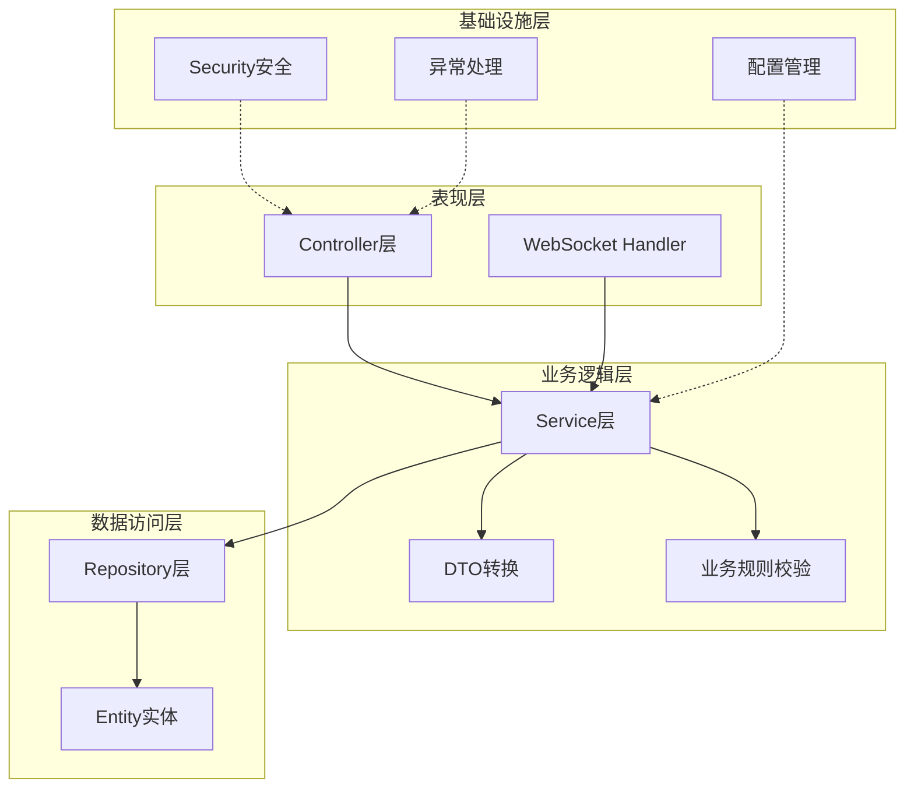

### 3.2 核心模块划分

系统按照业务功能划分为以下核心模块：

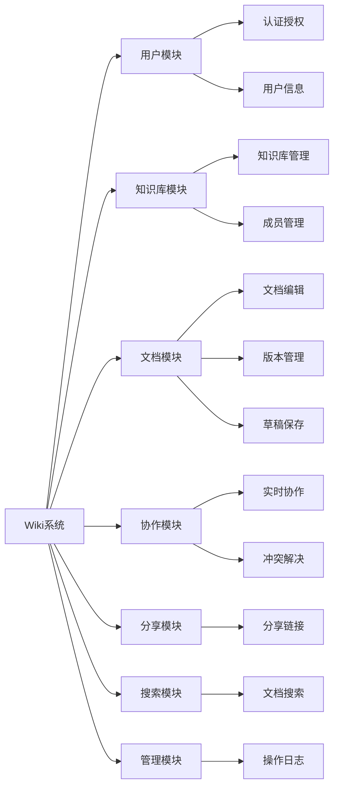

---

## 四、核心模块设计

### 4.1 用户认证模块

#### 4.1.1 认证流程

系统采用JWT令牌进行无状态认证，支持用户名/邮箱/手机号登录。

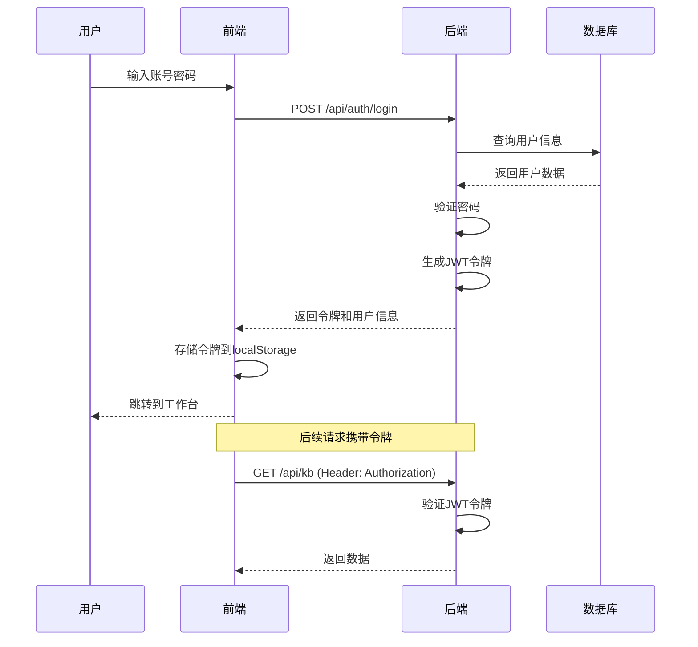

#### 4.1.2 权限控制

系统定义了两种用户角色：

- **ADMIN**：管理员，可查看操作日志
- **USER**：普通用户

知识库成员角色：

- **OWNER**：所有者，拥有全部权限
- **ADMIN**：管理员，可管理成员
- **EDITOR**：编辑者，可编辑文档
- **VIEWER**：查看者，只读权限

### 4.2 文档管理模块

#### 4.2.1 文档树形结构

文档支持树形层级结构，通过parent_id字段实现父子关系。

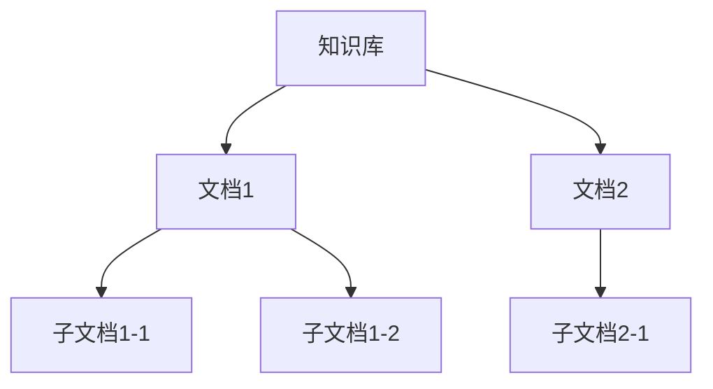

#### 4.2.2 版本管理

每次保存文档时自动创建版本记录，支持版本对比和回滚。

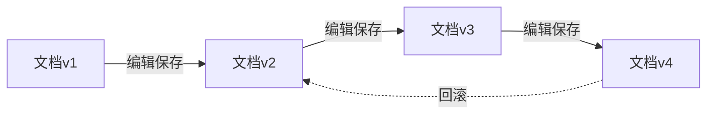

#### 4.2.3 草稿自动保存

前端每30秒自动保存草稿到后端，避免数据丢失。

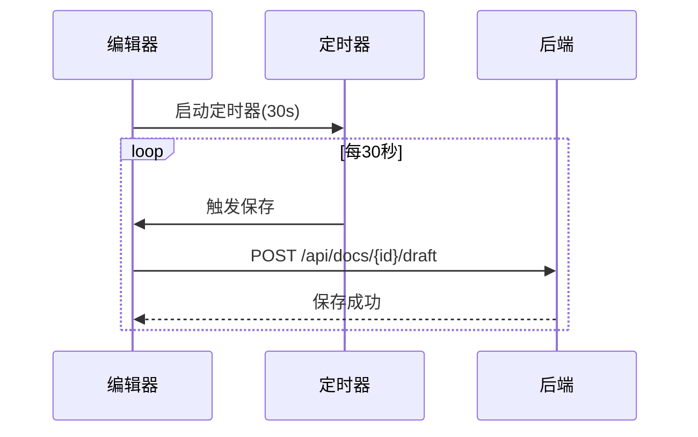

### 4.3 实时协作模块

#### 4.3.1 协作架构

基于WebSocket实现多人实时编辑，使用OT算法解决操作冲突。

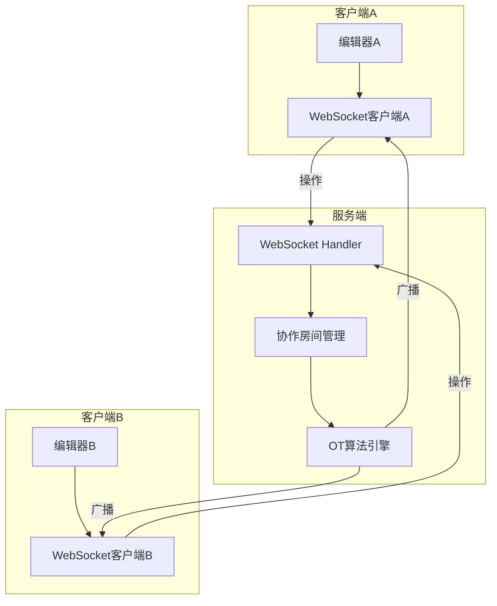

#### 4.3.2 操作转换流程

当多个用户同时编辑时，通过OT算法转换操作，保证最终一致性。

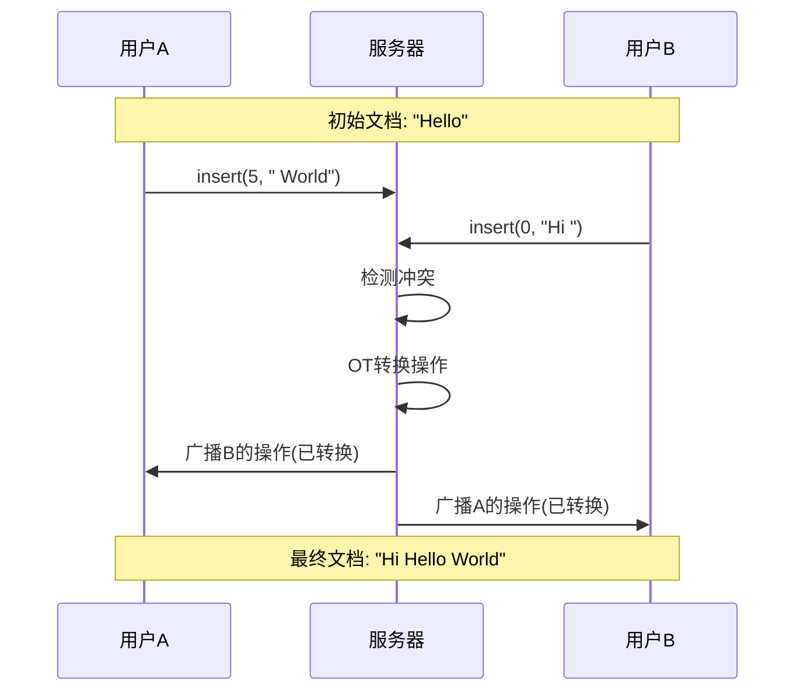

### 4.4 搜索模块

系统提供两种搜索实现：

- **本地搜索**：基于数据库LIKE查询（默认）
- **Elasticsearch搜索**：全文索引搜索（可选）

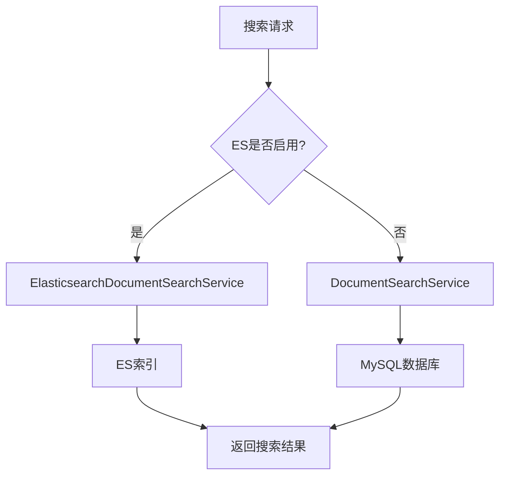

---

## 五、数据库设计

### 5.1 核心表结构

系统主要包含以下核心数据表：

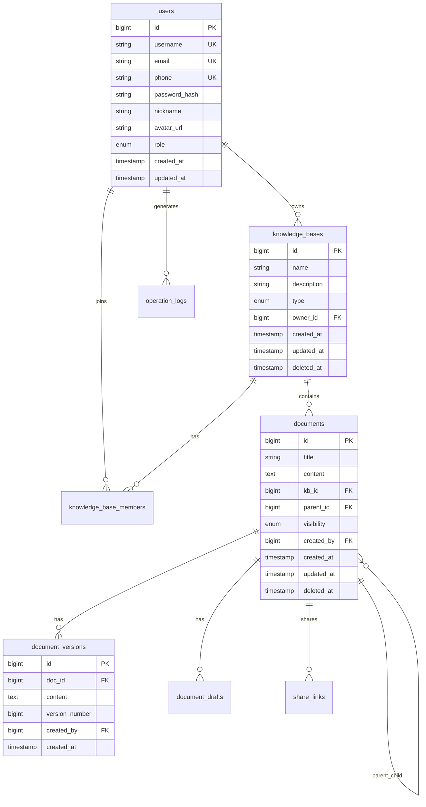

### 5.2 索引设计

为提高查询性能，在以下字段上建立索引：

- `users`表：username, email, phone（唯一索引）
- `knowledge_bases`表：owner_id
- `documents`表：kb_id, parent_id, deleted_at（复合索引）
- `knowledge_base_members`表：kb_id, user_id（复合索引）

### 5.3 软删除机制

所有实体继承`BaseEntity`，包含`deleted_at`字段实现软删除，删除的数据保留30天后由定时任务清理。

---

## 六、接口设计

### 6.1 RESTful API规范

系统遵循RESTful设计规范，统一使用`ApiResponse`包装响应数据。

#### 6.1.1 统一响应格式

```json
{
  "success": true,
  "message": "操作成功",
  "data": { ... }
}
```

#### 6.1.2 主要API端点

| 模块 | 端点 | 方法 | 说明 |
|------|------|------|------|
| 认证 | /api/auth/login | POST | 用户登录 |
| 认证 | /api/auth/register | POST | 用户注册 |
| 知识库 | /api/kb | GET | 获取知识库列表 |
| 知识库 | /api/kb | POST | 创建知识库 |
| 文档 | /api/docs | POST | 创建文档 |
| 文档 | /api/docs/{id} | GET | 获取文档详情 |
| 文档 | /api/docs/{id} | PUT | 更新文档 |
| 文档 | /api/docs/{id}/versions | GET | 获取版本列表 |
| 文档 | /api/docs/{id}/draft | POST | 保存草稿 |
| 分享 | /api/share | POST | 创建分享链接 |
| 搜索 | /api/docs/search | GET | 搜索文档 |

### 6.2 WebSocket协议

#### 6.2.1 连接端点

```
ws://localhost:8080/ws/collab/{docId}?token={jwt_token}
```

#### 6.2.2 消息格式

```json
{
  "type": "operation",
  "data": {
    "ops": [...],
    "baseVersion": 10
  }
}
```

消息类型包括：

- `join`：加入协作
- `leave`：离开协作
- `operation`：编辑操作
- `cursor`：光标位置
- `conflict`：冲突通知

---

## 七、安全设计

### 7.1 认证安全

- 使用JWT令牌进行无状态认证
- 令牌有效期24小时
- 密码使用BCrypt加密存储
- 支持验证码登录（5分钟有效期）

### 7.2 授权控制

- 基于Spring Security实现RBAC权限控制
- 知识库级别的成员权限管理
- 文档可见性控制（PUBLIC/PRIVATE/TEAM）

### 7.3 数据安全

- 所有API请求需携带JWT令牌（公开端点除外）
- 敏感操作记录操作日志
- 软删除机制防止数据误删
- 编辑锁机制防止并发冲突

---

## 八、性能优化

### 8.1 缓存策略

使用Redis缓存热点数据，减少数据库查询压力：

- 列表数据缓存：10分钟
- HTML渲染缓存：12小时
- 编辑锁缓存：30分钟

### 8.2 异步处理

使用`@Async`注解实现异步任务：

- 文档删除后的存储清理
- 云存储文件清理
- 邮件发送

### 8.3 数据库优化

- 合理设计索引
- 使用分页查询
- 软删除避免物理删除开销
- 使用Snowflake算法生成分布式ID

---

## 九、部署架构

### 9.1 开发环境

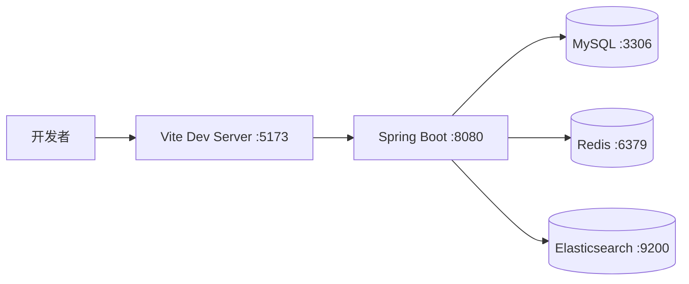

### 9.2 生产环境建议

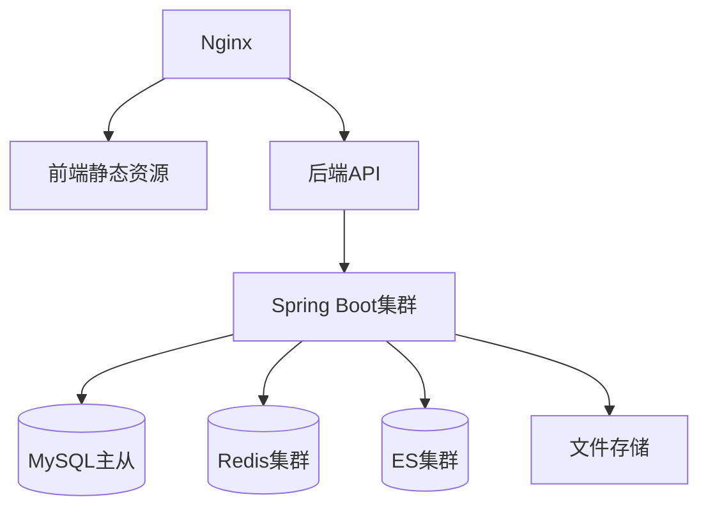

### 9.3 配置说明

主要配置项（application.yml）：

- 数据库连接信息
- Redis连接信息
- JWT密钥和过期时间
- 文件存储路径
- Elasticsearch开关
- 邮件服务配置

---

## 十、总结

本系统采用前后端分离的架构设计，前端使用Vue 3构建现代化的单页应用，后端使用Spring Boot提供稳定的RESTful API和WebSocket服务。系统具有以下特点：

1. **模块化设计**：按业务功能划分模块，职责清晰，易于维护
2. **实时协作**：基于WebSocket和OT算法实现多人实时编辑
3. **安全可靠**：完善的认证授权机制和数据安全保障
4. **性能优化**：合理使用缓存和异步处理提升系统性能
5. **可扩展性**：支持Elasticsearch、云存储等可选组件

系统架构设计充分考虑了功能需求、性能要求和未来扩展性，为项目的顺利实施提供了坚实的技术基础。
