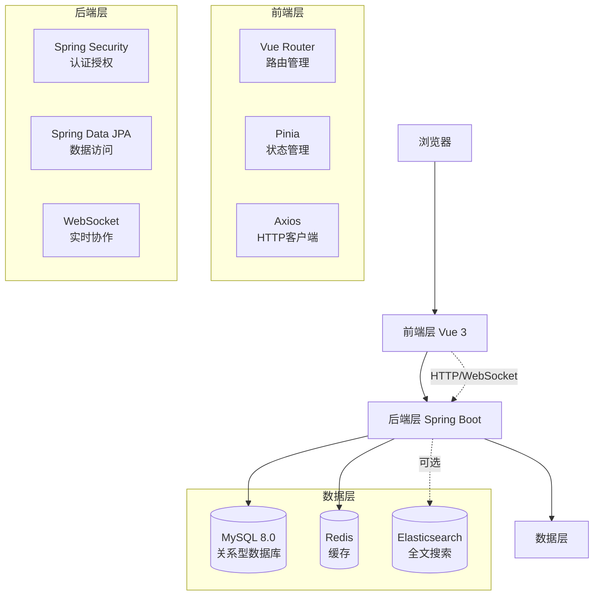
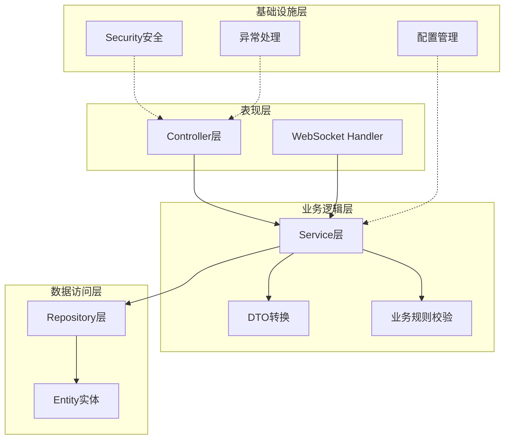
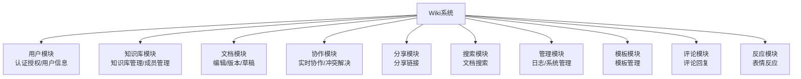
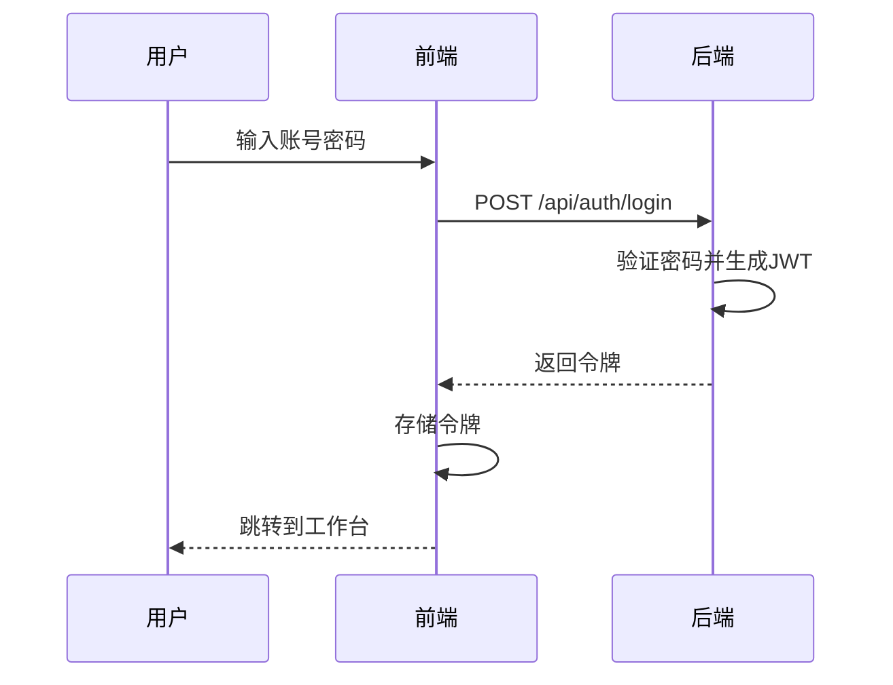
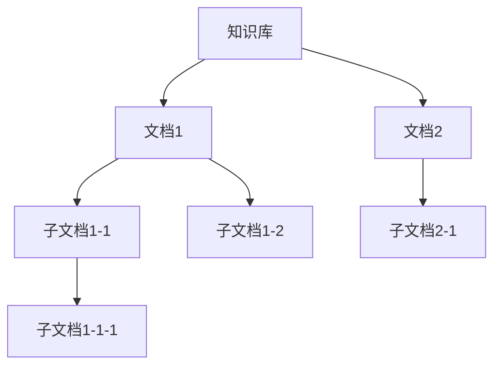
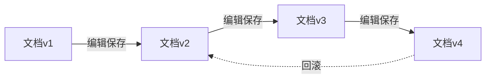
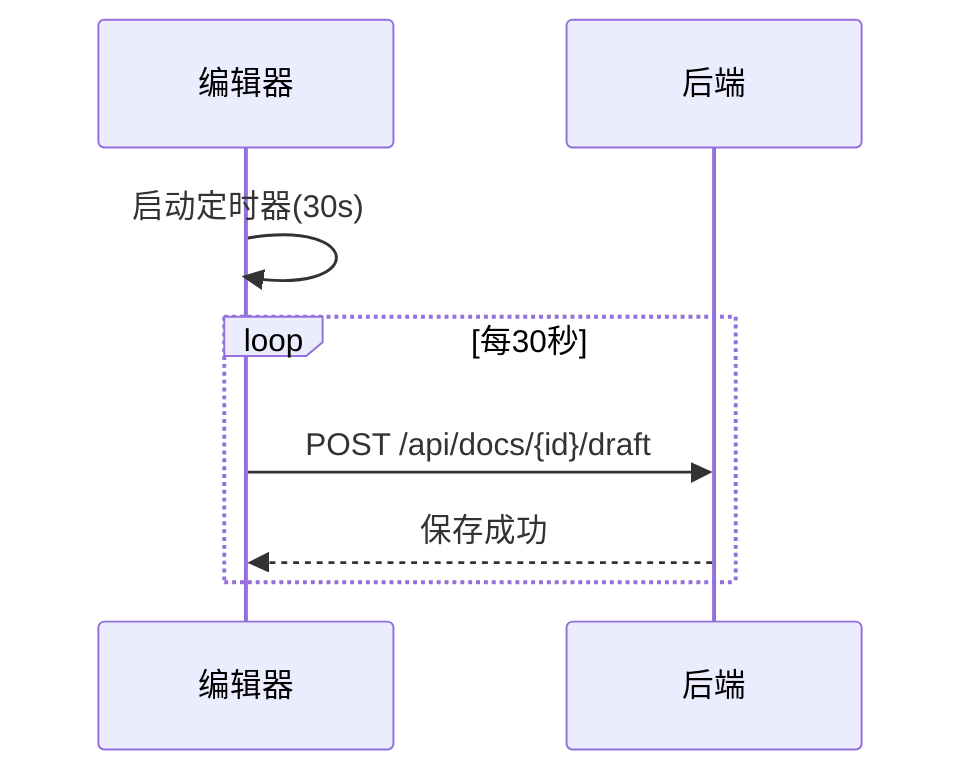
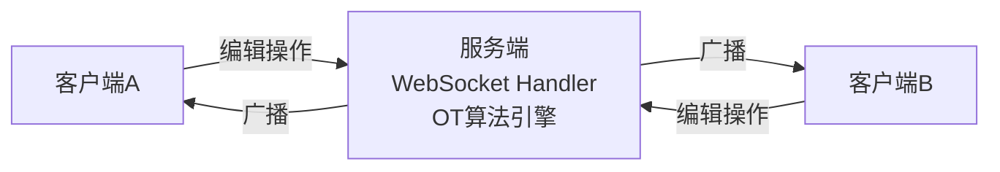
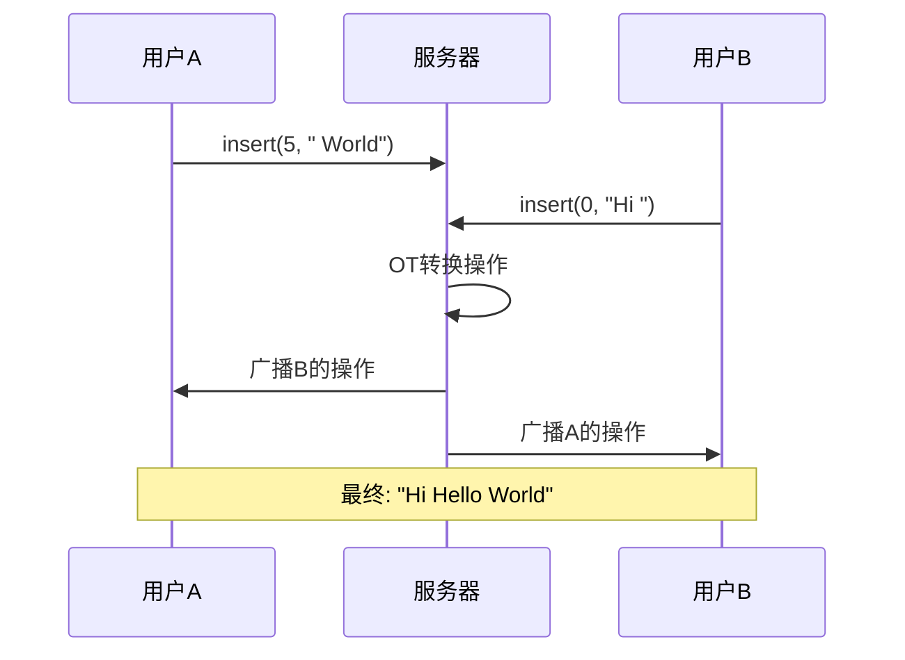
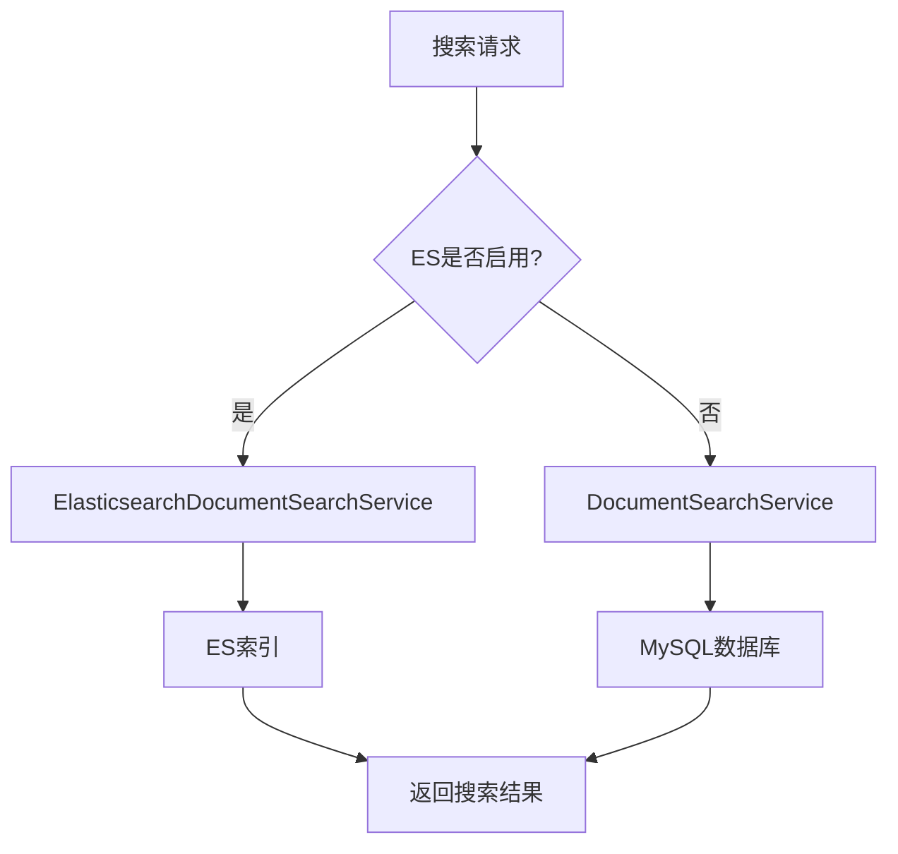

# 企业内部知识库（Wiki）系统 - 系统架构设计文档

## 一、引言

### （一）编写目的

本文档描述企业内部知识库系统的整体架构设计，包括技术选型、系统架构、模块划分等内容，为开发和维护提供技术参考。

### （二）项目背景

企业内部知识库系统是一个支持多人协作的在线文档平台，用户可以创建知识库、编写Markdown文档、实时协作编辑，并通过分享链接将文档分享给他人。

### （三）术语定义

- **知识库（KB）**：文档的集合容器
- **文档（Document）**：知识库中的Markdown文档
- **草稿（Draft）**：文档的自动保存副本
- **协作房间（Collab Room）**：支持多人实时编辑的WebSocket会话
- **OT算法**：操作转换算法，用于解决协作冲突

## 二、系统架构

### （一）总体架构

系统采用前后端分离架构，前端使用Vue 3构建单页应用，后端使用Spring Boot提供RESTful API和WebSocket服务。


```mermaid
graph TB
    A[浏览器] --> B[前端层 Vue 3]
    B --> C[后端层 Spring Boot]
    C --> D[数据层]

    subgraph 前端层
        B1[Vue Router<br/>路由管理]
        B2[Pinia<br/>状态管理]
        B3[Axios<br/>HTTP客户端]
    end

    subgraph 后端层
        C1[Spring Security<br/>认证授权]
        C2[Spring Data JPA<br/>数据访问]
        C3[WebSocket<br/>实时协作]
    end

    subgraph 数据层
        D1[(MySQL 8.0<br/>关系型数据库)]
        D2[(Redis<br/>缓存)]
        D3[(Elasticsearch<br/>全文搜索)]
    end

    B -.HTTP/WebSocket.-> C
    C --> D1
    C --> D2
    C -.可选.-> D3
```

### （二）技术栈

#### 1. 前端技术栈

| 技术 | 版本 | 用途 |
|------|------|------|
| Vue | 3.5.12 | 前端框架 |
| Vue Router | 4.4.5 | 路由管理 |
| Pinia | 2.2.4 | 状态管理 |
| Vite | 5.4.8 | 构建工具 |
| Axios | 1.7.7 | HTTP客户端 |
| Marked | 14.1.2 | Markdown渲染 |

#### 2. 后端技术栈

| 技术 | 版本 | 用途 |
|------|------|------|
| Spring Boot | 3.3.5 | 后端框架 |
| Spring Data JPA | 3.3.5 | ORM框架 |
| Spring Security | 6.3.4 | 认证授权 |
| Spring WebSocket | 6.1.14 | 实时协作 |
| MySQL | 8.0 | 关系型数据库 |
| Redis | 7.x | 缓存 |
| JWT | 0.12.6 | 令牌认证 |

## 三、系统分层设计

### （一）分层架构

系统采用经典的三层架构模式：


```mermaid
graph TB
    subgraph 表现层
        A1[Controller层]
        A2[WebSocket Handler]
    end

    subgraph 业务逻辑层
        B1[Service层]
        B2[DTO转换]
        B3[业务规则校验]
    end

    subgraph 数据访问层
        C1[Repository层]
        C2[Entity实体]
    end

    subgraph 基础设施层
        D1[Security安全]
        D2[异常处理]
        D3[配置管理]
    end

    A1 --> B1
    A2 --> B1
    B1 --> B2
    B1 --> B3
    B1 --> C1
    C1 --> C2
    D1 -.-> A1
    D2 -.-> A1
    D3 -.-> B1
```

### （二）模块划分

系统按业务功能划分为以下模块：


```mermaid
graph TB
    A[Wiki系统]
    A --> B[用户模块<br/>认证授权/用户信息]
    A --> C[知识库模块<br/>知识库管理/成员管理]
    A --> D[文档模块<br/>编辑/版本/草稿]
    A --> E[协作模块<br/>实时协作/冲突解决]
    A --> F[分享模块<br/>分享链接]
    A --> G[搜索模块<br/>文档搜索]
    A --> H[管理模块<br/>日志/系统管理]
    A --> I[模板模块<br/>模板管理]
    A --> J[评论模块<br/>评论回复]
    A --> K[反应模块<br/>表情反应]
```

## 四、核心功能设计

### （一）用户认证

系统采用JWT令牌进行无状态认证，支持用户名/邮箱/手机号登录。

**认证流程：**


```mermaid
sequenceDiagram
    participant U as 用户
    participant F as 前端
    participant B as 后端

    U->>F: 输入账号密码
    F->>B: POST /api/auth/login
    B->>B: 验证密码并生成JWT
    B-->>F: 返回令牌
    F->>F: 存储令牌
    F-->>U: 跳转到工作台
```

**权限控制：**

- 系统角色：ADMIN（管理员）、USER（普通用户）
- 知识库角色：OWNER（所有者）、ADMIN（管理员）、EDITOR（编辑者）、VIEWER（查看者）

### （二）文档管理

**文档树形结构：**

文档通过parent_id字段实现树形层级结构，支持无限层级。


```mermaid
graph TD
    A[知识库] --> B[文档1]
    A --> C[文档2]
    B --> D[子文档1-1]
    B --> E[子文档1-2]
    C --> F[子文档2-1]
    D --> G[子文档1-1-1]
```

**版本管理：**

每次保存文档时自动创建版本记录，支持版本对比和回滚。


```mermaid
graph LR
    A[文档v1] -->|编辑保存| B[文档v2]
    B -->|编辑保存| C[文档v3]
    C -->|编辑保存| D[文档v4]
    D -.回滚.-> B
```

**草稿自动保存：**

前端每30秒自动保存草稿到后端，避免数据丢失。


```mermaid
sequenceDiagram
    participant E as 编辑器
    participant B as 后端

    E->>E: 启动定时器(30s)
    loop 每30秒
        E->>B: POST /api/docs/{id}/draft
        B-->>E: 保存成功
    end
```

### （三）实时协作

基于WebSocket实现多人实时编辑，使用OT算法解决操作冲突。

**协作架构：**


```mermaid
graph LR
    A[客户端A] -->|编辑操作| S[服务端<br/>WebSocket Handler<br/>OT算法引擎]
    B[客户端B] -->|编辑操作| S
    S -->|广播| A
    S -->|广播| B
```

**协作流程：**


```mermaid
sequenceDiagram
    participant A as 用户A
    participant S as 服务器
    participant B as 用户B

    A->>S: insert(5, " World")
    B->>S: insert(0, "Hi ")
    S->>S: OT转换操作
    S->>A: 广播B的操作
    S->>B: 广播A的操作
    Note over A,B: 最终: "Hi Hello World"
```

### （四）搜索功能

系统提供两种搜索实现：


```mermaid
graph TB
    A[搜索请求] --> B{ES是否启用?}
    B -->|是| C[ElasticsearchDocumentSearchService]
    B -->|否| D[DocumentSearchService]
    C --> E[ES索引]
    D --> F[MySQL数据库]
    E --> G[返回搜索结果]
    F --> G
```

- **本地搜索**：基于MySQL LIKE查询（默认）
- **Elasticsearch搜索**：全文索引搜索（可选）

## 五、数据库设计

### （一）核心表

- **users**：用户表
- **departments**：部门表
- **knowledge_bases**：知识库表
- **knowledge_base_members**：知识库成员表
- **documents**：文档表
- **document_versions**：文档版本表
- **document_drafts**：文档草稿表
- **document_templates**：文档模板表
- **document_comments**：文档评论表
- **document_reactions**：文档反应表
- **share_links**：分享链接表
- **operation_logs**：操作日志表

### （二）索引设计

为提高查询性能，在以下字段上建立索引：

- users表：username, email, phone（唯一索引）
- knowledge_bases表：owner_id
- documents表：kb_id, parent_id, deleted_at
- knowledge_base_members表：kb_id, user_id

### （三）软删除机制

所有实体包含deleted_at字段实现软删除，删除的数据保留30天后由定时任务清理。

## 六、接口设计

### （一）RESTful API规范

系统遵循RESTful设计规范，统一使用ApiResponse包装响应数据。

**统一响应格式：**

```json
{
  "success": true,
  "message": "操作成功",
  "data": {}
}
```

**主要API端点：**

| 模块 | 端点 | 方法 | 说明 |
|------|------|------|------|
| 认证 | /api/auth/login | POST | 用户登录 |
| 认证 | /api/auth/register | POST | 用户注册 |
| 知识库 | /api/kbs | GET | 获取知识库列表 |
| 文档 | /api/docs | POST | 创建文档 |
| 文档 | /api/docs/{id} | GET | 获取文档详情 |
| 模板 | /api/templates | GET | 获取模板列表 |
| 评论 | /api/docs/{id}/comments | GET | 获取评论列表 |
| 反应 | /api/docs/{id}/reactions | GET | 获取反应统计 |

### （二）WebSocket协议

**连接端点：**

```
ws://localhost:8080/ws/collab/{docId}?token={jwt_token}
```

**消息类型：**

- join：加入协作
- leave：离开协作
- operation：编辑操作
- cursor：光标位置
- conflict：冲突通知

## 七、安全设计

### （一）认证安全

- 使用JWT令牌进行无状态认证
- 令牌有效期7天
- 密码使用BCrypt加密存储
- 支持验证码登录（5分钟有效期）

### （二）授权控制

- 基于Spring Security实现RBAC权限控制
- 知识库级别的成员权限管理
- 文档可见性控制（PUBLIC/PRIVATE/TEAM）

### （三）数据安全

- 所有API请求需携带JWT令牌
- 敏感操作记录操作日志
- 软删除机制防止数据误删
- 编辑锁机制防止并发冲突

## 八、性能优化

### （一）缓存策略

使用Redis缓存热点数据：

- 列表数据缓存：10分钟
- HTML渲染缓存：1小时
- 编辑锁缓存：5分钟
- 验证码缓存：5分钟

### （二）异步处理

使用@Async注解实现异步任务：

- 文档删除后的存储清理
- 云存储文件清理
- 邮件发送

### （三）数据库优化

- 合理设计索引
- 使用分页查询
- 软删除避免物理删除开销
- 使用Snowflake算法生成分布式ID

## 九、总结

本系统采用前后端分离的架构设计，前端使用Vue 3构建现代化的应用，后端使用Spring Boot提供稳定的RESTful API和WebSocket服务。系统具有模块化设计、实时协作、安全可靠、性能优化、可扩展性等特点，能够满足企业内部知识管理的需求。
