# 企业内部知识库（Wiki）系统 - 需求规格说明书

## 一、项目简介

### （一）项目背景

现在团队协作越来越多，但传统的文档管理方式有很多问题：
- 多人编辑同一个文档容易冲突
- 找不到文档的历史版本
- 权限管理很麻烦
- 搜索功能太弱

所以我们想做一个类似语雀那样的知识库系统，支持多人实时协作编辑、版本管理、权限控制等功能。

### （二）主要功能

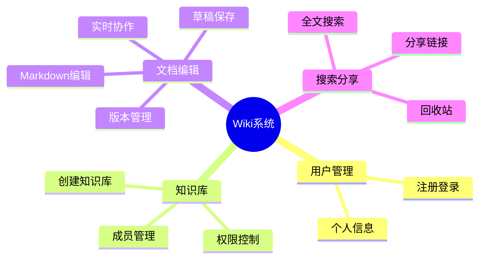
```mermaid
mindmap
  root((Wiki系统))
    用户管理
      注册登录
      个人信息
    知识库
      创建知识库
      成员管理
      权限控制
    文档编辑
      Markdown编辑
      实时协作
      版本管理
      草稿保存
    搜索分享
      全文搜索
      分享链接
      回收站
```

### （三）术语说明

| 术语 | 解释 |
|------|------|
| 知识库 | 就是一个文档集合，有自己的目录结构和成员权限 |
| 文档 | 知识库里的一篇文章，用 Markdown 格式写的 |
| 版本 | 文档的历史记录，可以看到之前改了什么 |
| 草稿 | 临时保存的内容，还没正式发布 |
| OT 算法 | 解决多人同时编辑冲突的算法 |
| 软删除 | 删除时只是标记一下，数据还在，可以恢复 |

### （四）参考资料

- 语雀、Notion 等产品
- Spring Boot 3 文档
- Vue.js 3 文档
- 一些协同编辑的论文

---

## 二、系统设计

### （一）整体架构

我们采用前后端分离的架构，这样前端和后端可以独立开发和部署。

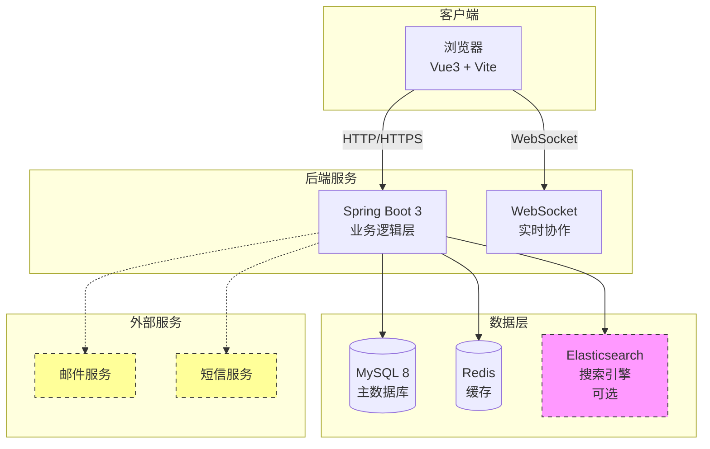
```mermaid
graph TB
    subgraph 客户端
        A[浏览器<br/>Vue3 + Vite]
    end

    subgraph 后端服务
        B[Spring Boot 3<br/>业务逻辑层]
        C[WebSocket<br/>实时协作]
    end

    subgraph 数据层
        D[(MySQL 8<br/>主数据库)]
        E[(Redis<br/>缓存)]
        F[Elasticsearch<br/>搜索引擎<br/>可选]
    end

    subgraph 外部服务
        G[邮件服务]
        H[短信服务]
    end

    A -->|HTTP/HTTPS| B
    A -->|WebSocket| C
    B --> D
    B --> E
    B --> F
    B -.-> G
    B -.-> H

    style F fill:#f9f,stroke:#333,stroke-dasharray: 5 5
    style G fill:#ff9,stroke:#333,stroke-dasharray: 5 5
    style H fill:#ff9,stroke:#333,stroke-dasharray: 5 5
```

### （二）技术栈

**后端：**
- Spring Boot 3（主框架）
- Spring Data JPA（数据库操作）
- MySQL 8（存数据）
- Redis（缓存，提高速度）
- WebSocket（实时通信）

**前端：**
- Vue 3（界面框架）
- Vite（构建工具，比 Webpack 快）
- Pinia（状态管理）

**可选组件：**
- Elasticsearch（搜索引擎，没有的话用 MySQL 的 LIKE 查询代替）
- 邮件服务（发验证码）
- 短信服务（发验证码）

### （三）系统流程

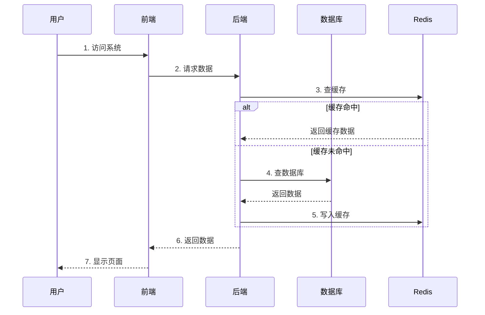
```mermaid
sequenceDiagram
    participant U as 用户
    participant F as 前端
    participant B as 后端
    participant DB as 数据库
    participant R as Redis

    U->>F: 1. 访问系统
    F->>B: 2. 请求数据
    B->>R: 3. 查缓存
    alt 缓存命中
        R-->>B: 返回缓存数据
    else 缓存未命中
        B->>DB: 4. 查数据库
        DB-->>B: 返回数据
        B->>R: 5. 写入缓存
    end
    B-->>F: 6. 返回数据
    F-->>U: 7. 显示页面
```

---

## 三、功能需求

### （一）用户管理

#### 1. 用户注册流程

用户可以通过邮箱或手机号注册账号。

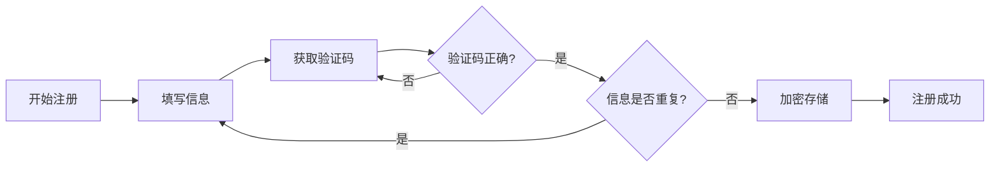
```mermaid
flowchart LR
    A[开始注册] --> B[填写信息]
    B --> C[获取验证码]
    C --> D{验证码正确?}
    D -->|否| C
    D -->|是| E{信息是否重复?}
    E -->|是| B
    E -->|否| F[加密存储]
    F --> G[注册成功]
```

**输入要求：**
- 用户名：3-20 个字符，不能重复
- 密码：8-32 个字符，要有大小写字母和数字
- 邮箱或手机号：必须是真实的，不能重复
- 验证码：6 位数字，5 分钟内有效

**注意事项：**
- 为了防止恶意注册，同一个 IP/邮箱/手机号 1 分钟内只能请求 1 次验证码
- 如果没配置邮件/短信服务，系统会进入测试模式，直接显示验证码

#### 2. 用户登录流程

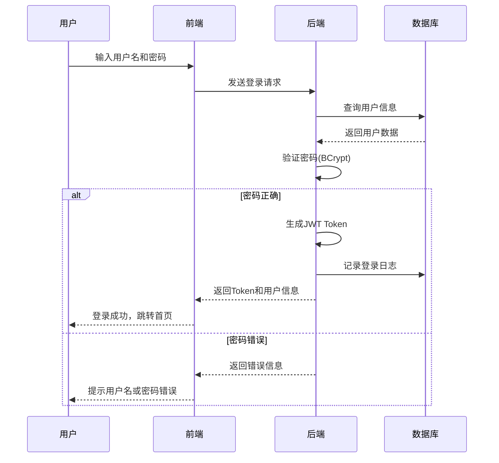
```mermaid
sequenceDiagram
    participant U as 用户
    participant F as 前端
    participant B as 后端
    participant DB as 数据库

    U->>F: 输入用户名和密码
    F->>B: 发送登录请求
    B->>DB: 查询用户信息
    DB-->>B: 返回用户数据
    B->>B: 验证密码(BCrypt)
    alt 密码正确
        B->>B: 生成JWT Token
        B->>DB: 记录登录日志
        B-->>F: 返回Token和用户信息
        F-->>U: 登录成功，跳转首页
    else 密码错误
        B-->>F: 返回错误信息
        F-->>U: 提示用户名或密码错误
    end
```

用户可以用用户名、邮箱或手机号登录，登录成功后会得到一个 Token（有效期 7 天），之后的请求都要带上这个 Token。

#### 3. 用户信息管理

用户可以修改自己的个人资料：
- 昵称
- 头像（可以上传图片或填写图片链接）
- 邮箱（需要验证码）
- 手机号（需要验证码）

修改邮箱或手机号时，需要验证新旧两个验证码，确保是本人操作。

### （二）知识库管理

#### 1. 知识库的概念

知识库就像一个文件夹，里面可以放很多文档，每个知识库有自己的成员和权限设置。

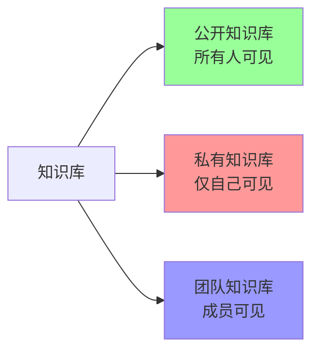
```mermaid
graph LR
    A[知识库] --> B[公开知识库<br/>所有人可见]
    A --> C[私有知识库<br/>仅自己可见]
    A --> D[团队知识库<br/>成员可见]

    style B fill:#9f9
    style C fill:#f99
    style D fill:#99f
```

#### 2. 创建知识库

用户可以创建新的知识库，需要填写：
- 知识库名称（1-50 个字符）
- 类型（公开/私有/团队）
- 描述（可选，最多 200 字）

创建后，创建者自动成为管理员。

#### 3. 成员权限管理

知识库有三种角色：

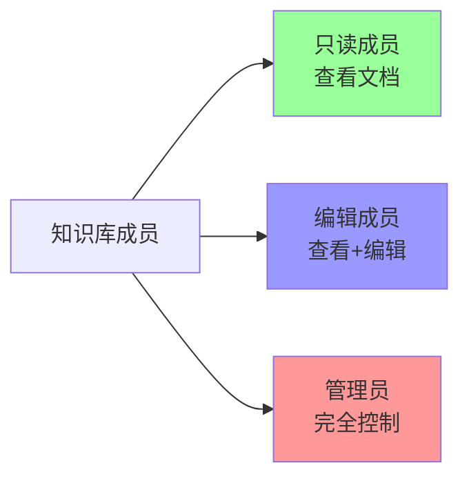
```mermaid
graph LR
    A[知识库成员] --> B[只读成员<br/>查看文档]
    A --> C[编辑成员<br/>查看+编辑]
    A --> D[管理员<br/>完全控制]

    style B fill:#9f9
    style C fill:#99f
    style D fill:#f99
```

管理员可以：
- 邀请新成员（通过用户名或邮箱）
- 修改成员的角色
- 移除成员

**注意：** 知识库至少要有一个管理员，不能把最后一个管理员移除。

### （三）文档管理

#### 1. 文档的树形结构

文档可以像文件夹一样组织成树形结构，支持无限层级。

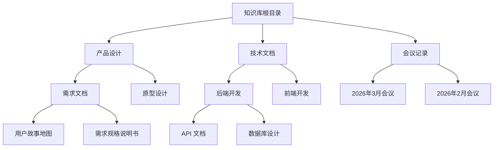
```mermaid
graph TD
    A[知识库根目录] --> B[产品设计]
    A --> C[技术文档]
    A --> D[会议记录]

    B --> B1[需求文档]
    B --> B2[原型设计]
    B1 --> B11[用户故事地图]
    B1 --> B12[需求规格说明书]

    C --> C1[后端开发]
    C --> C2[前端开发]
    C1 --> C11[API 文档]
    C1 --> C12[数据库设计]

    D --> D1[2026年3月会议]
    D --> D2[2026年2月会议]
```

#### 2. 创建和编辑文档

**创建文档时需要填写：**
- 文档标题（1-100 个字符）
- 父文档（可选，用来构建树形结构）
- 内容（用 Markdown 格式写）
- 可见性（公开/团队/私有）

**编辑流程：**

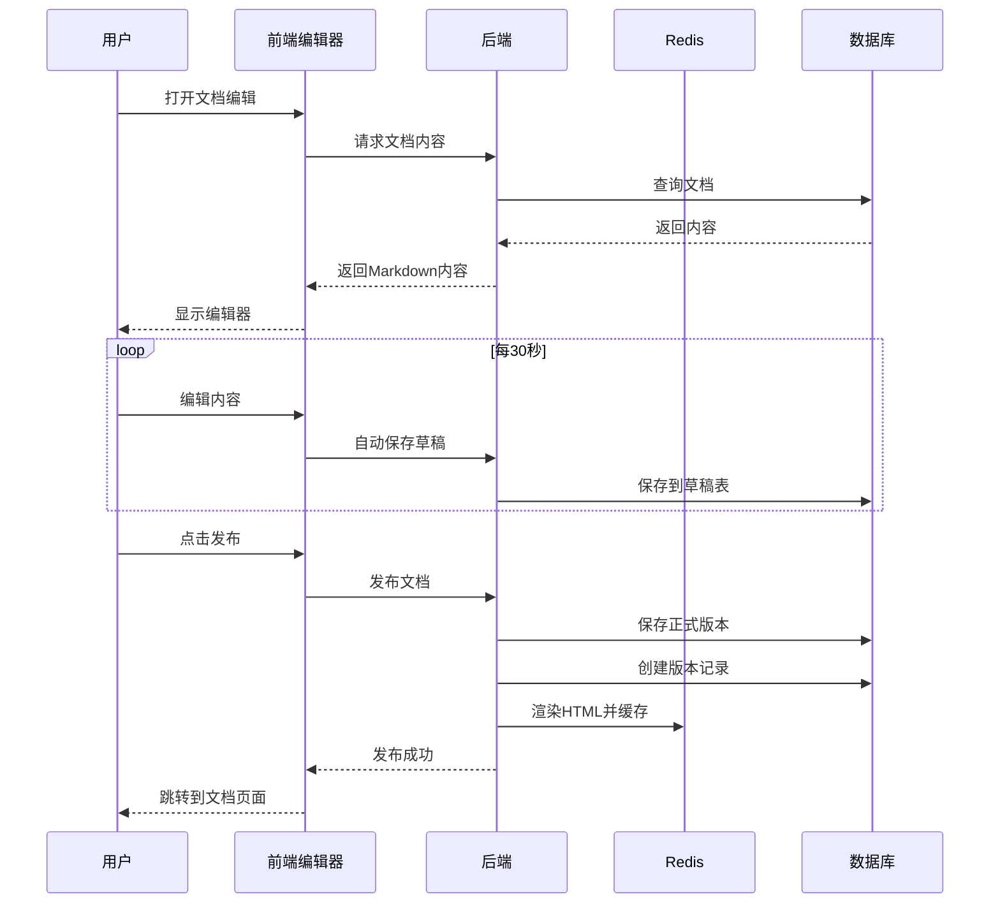
```mermaid
sequenceDiagram
    participant U as 用户
    participant F as 前端编辑器
    participant B as 后端
    participant R as Redis
    participant DB as 数据库

    U->>F: 打开文档编辑
    F->>B: 请求文档内容
    B->>DB: 查询文档
    DB-->>B: 返回内容
    B-->>F: 返回Markdown内容
    F-->>U: 显示编辑器

    loop 每30秒
        U->>F: 编辑内容
        F->>B: 自动保存草稿
        B->>DB: 保存到草稿表
    end

    U->>F: 点击发布
    F->>B: 发布文档
    B->>DB: 保存正式版本
    B->>DB: 创建版本记录
    B->>R: 渲染HTML并缓存
    B-->>F: 发布成功
    F-->>U: 跳转到文档页面
```

#### 3. 草稿自动保存

为了防止内容丢失，系统会自动保存草稿：

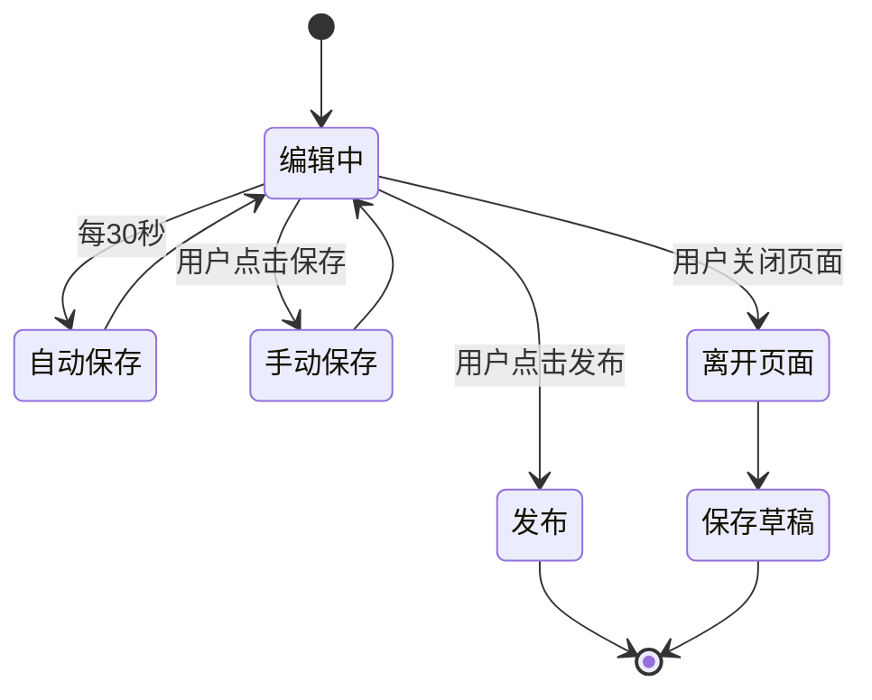
```mermaid
stateDiagram-v2
    [*] --> 编辑中
    编辑中 --> 自动保存: 每30秒
    自动保存 --> 编辑中
    编辑中 --> 手动保存: 用户点击保存
    手动保存 --> 编辑中
    编辑中 --> 发布: 用户点击发布
    发布 --> [*]
    编辑中 --> 离开页面: 用户关闭页面
    离开页面 --> 保存草稿
    保存草稿 --> [*]
```

**草稿规则：**
- 每 30 秒自动保存一次
- 用户主动保存时立即保存
- 离开编辑页面前自动保存
- 每个文档只保留最新一份草稿
- 草稿 30 天没更新会自动删除

### （四）协同编辑

#### 1. 多人实时协作

这是系统的核心功能之一，允许多个人同时编辑同一个文档，就像 Google Docs 那样。

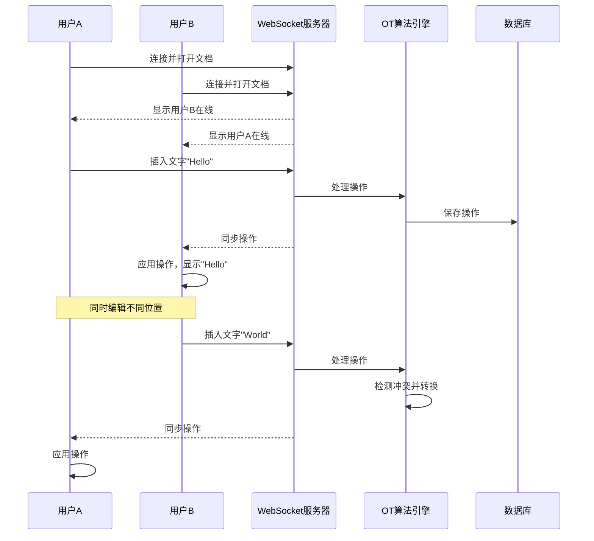
```mermaid
sequenceDiagram
    participant U1 as 用户A
    participant U2 as 用户B
    participant WS as WebSocket服务器
    participant OT as OT算法引擎
    participant DB as 数据库

    U1->>WS: 连接并打开文档
    U2->>WS: 连接并打开文档
    WS-->>U1: 显示用户B在线
    WS-->>U2: 显示用户A在线

    U1->>WS: 插入文字"Hello"
    WS->>OT: 处理操作
    OT->>DB: 保存操作
    WS-->>U2: 同步操作
    U2->>U2: 应用操作，显示"Hello"

    Note over U1,U2: 同时编辑不同位置
    U2->>WS: 插入文字"World"
    WS->>OT: 处理操作
    OT->>OT: 检测冲突并转换
    WS-->>U1: 同步操作
    U1->>U1: 应用操作
```

**实时显示的信息：**
- 在线协作者列表（显示头像和名字）
- 其他用户的光标位置（用不同颜色标记）
- 其他用户选中的文本范围

**技术实现：**
- 使用 WebSocket 进行实时通信
- 使用 OT（Operational Transformation）算法处理并发编辑冲突
- 服务端维护文档状态和操作历史

#### 2. 编辑锁机制

为了避免太多人同时编辑造成混乱，我们设计了编辑锁：

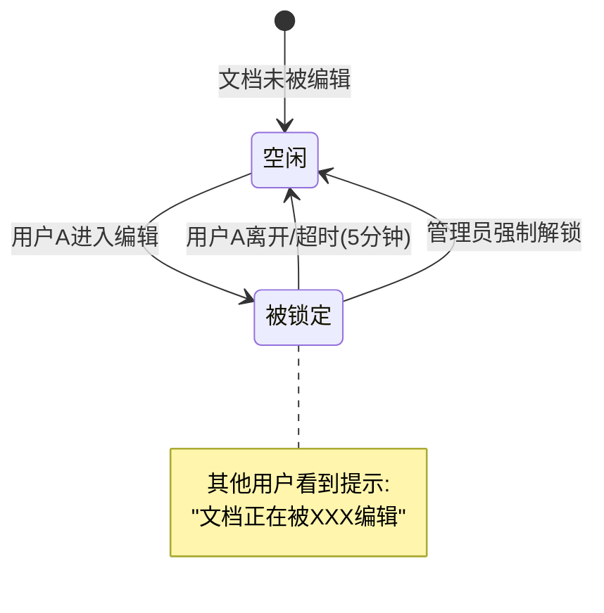
```mermaid
stateDiagram-v2
    [*] --> 空闲: 文档未被编辑
    空闲 --> 被锁定: 用户A进入编辑
    被锁定 --> 空闲: 用户A离开/超时(5分钟)
    被锁定 --> 空闲: 管理员强制解锁

    note right of 被锁定
        其他用户看到提示:
        "文档正在被XXX编辑"
    end note
```

**工作原理：**
- 用户进入编辑页面时，在 Redis 设置一个锁（有效期 5 分钟）
- 其他用户尝试编辑时会看到提示
- 用户离开页面或超时后自动释放锁
- 管理员可以强制解锁（比如有人忘记关闭页面）

#### 3. 冲突处理

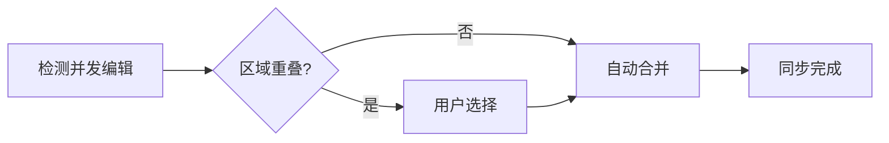
```mermaid
flowchart LR
    A[检测并发编辑] --> B{区域重叠?}
    B -->|否| C[自动合并]
    B -->|是| D[用户选择]
    D --> C
    C --> E[同步完成]
```

### （五）搜索功能

#### 1. 全文检索

用户可以搜索文档的标题和内容，只能搜到自己有权限看的文档。

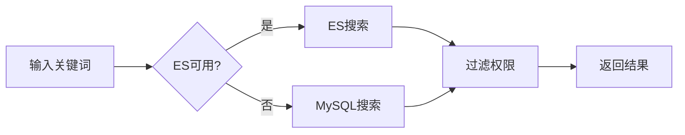
```mermaid
flowchart LR
    A[输入关键词] --> B{ES可用?}
    B -->|是| C[ES搜索]
    B -->|否| D[MySQL搜索]
    C --> E[过滤权限]
    D --> E
    E --> F[返回结果]
```

**搜索范围：**
- 只搜索用户有权限访问的文档
- 可以按知识库筛选

**技术方案：**
- 优先使用 Elasticsearch（速度快，支持中文分词）
- 如果没有 ES，就用 MySQL 的 LIKE 查询（速度慢一点）

### （六）分享功能

可以把文档分享给没有账号的人看。

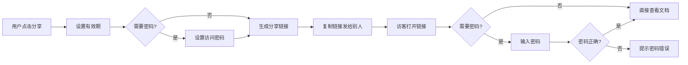
```mermaid
flowchart LR
    A[用户点击分享] --> B[设置有效期]
    B --> C{需要密码?}
    C -->|是| D[设置访问密码]
    C -->|否| E[生成分享链接]
    D --> E
    E --> F[复制链接发给别人]
    F --> G[访客打开链接]
    G --> H{需要密码?}
    H -->|是| I[输入密码]
    H -->|否| J[直接查看文档]
    I --> K{密码正确?}
    K -->|是| J
    K -->|否| L[提示密码错误]
```

**分享设置：**
- 有效期：1 天/7 天/30 天/永久
- 可选密码保护
- 可以随时撤销分享

### （七）回收站

删除的文档不会立即消失，会先放到回收站，30 天内可以恢复。

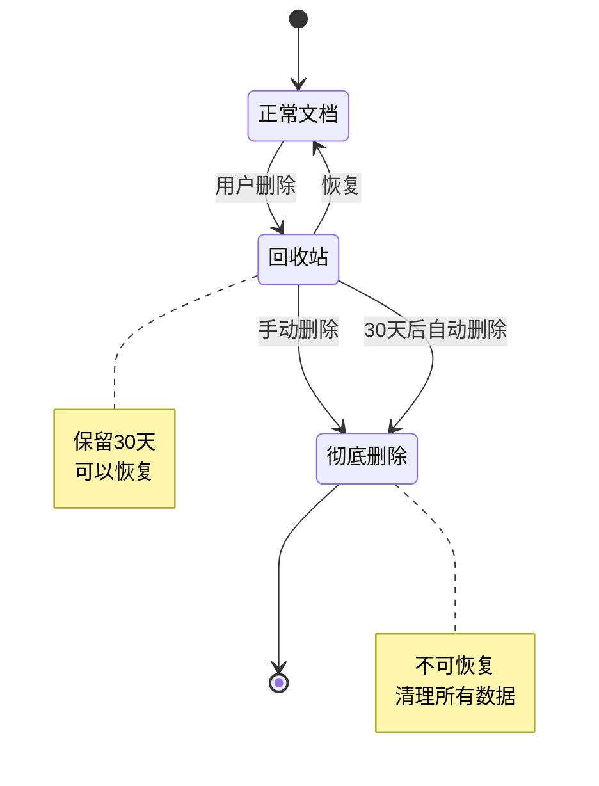
```mermaid
stateDiagram-v2
    [*] --> 正常文档
    正常文档 --> 回收站: 用户删除
    回收站 --> 正常文档: 恢复
    回收站 --> 彻底删除: 手动删除
    回收站 --> 彻底删除: 30天后自动删除
    彻底删除 --> [*]

    note right of 回收站
        保留30天
        可以恢复
    end note

    note right of 彻底删除
        不可恢复
        清理所有数据
    end note
```

**删除流程：**
1. 用户点删除 → 文档移入回收站
2. 回收站保留 30 天
3. 30 天后自动彻底删除

**恢复操作：**
- 从回收站恢复到原来的位置
- 如果父文档也被删了，就恢复到根目录

**彻底删除：**
- 需要二次确认（防止误操作）
- 删除数据库记录
- 清理文件存储

### （八）管理后台

#### 1. 操作日志

系统会记录重要操作，方便追溯问题。

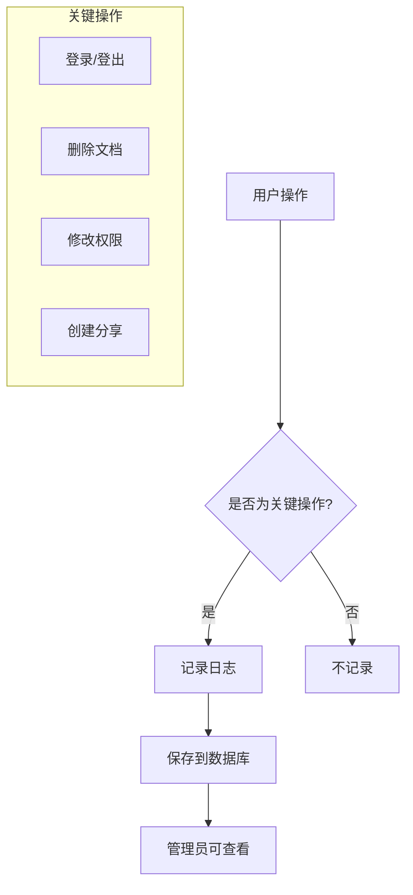
```mermaid
graph TD
    A[用户操作] --> B{是否为关键操作?}
    B -->|是| C[记录日志]
    B -->|否| D[不记录]
    C --> E[保存到数据库]
    E --> F[管理员可查看]

    subgraph 关键操作
        G[登录/登出]
        H[删除文档]
        I[修改权限]
        J[创建分享]
    end
```

**记录的信息：**
- 操作类型（登录、删除、分享、权限变更等）
- 操作时间
- 操作人
- IP 地址
- 详细信息

**查询功能：**
- 按时间筛选
- 按用户筛选
- 按操作类型筛选
- 按 IP 筛选

#### 2. 用户管理

管理员可以管理所有用户。

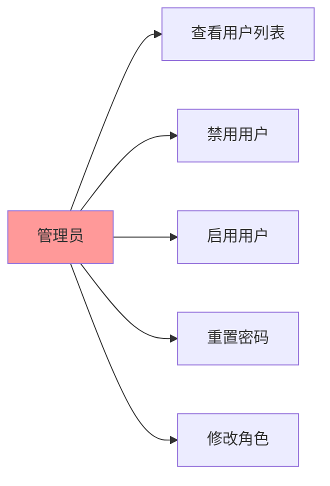
```mermaid
graph LR
    A[管理员] --> B[查看用户列表]
    A --> C[禁用用户]
    A --> D[启用用户]
    A --> E[重置密码]
    A --> F[修改角色]

    style A fill:#f99
```

---

## 四、性能和其他要求

### （一）性能指标

我们希望系统能达到以下性能：

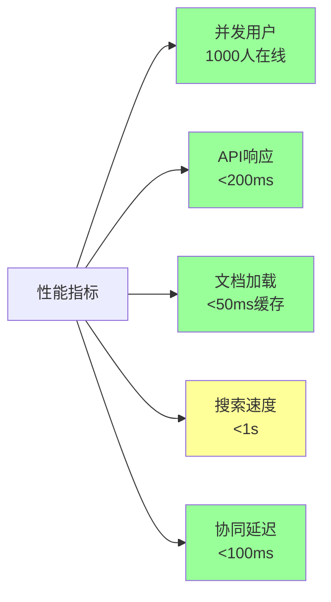
```mermaid
graph LR
    A[性能指标] --> B[并发用户<br/>1000人在线]
    A --> C[API响应<br/><200ms]
    A --> D[文档加载<br/><50ms缓存]
    A --> E[搜索速度<br/><1s]
    A --> F[协同延迟<br/><100ms]

    style B fill:#9f9
    style C fill:#9f9
    style D fill:#9f9
    style E fill:#ff9
    style F fill:#9f9
```

### （二）安全性设计

#### 1. 用户认证流程

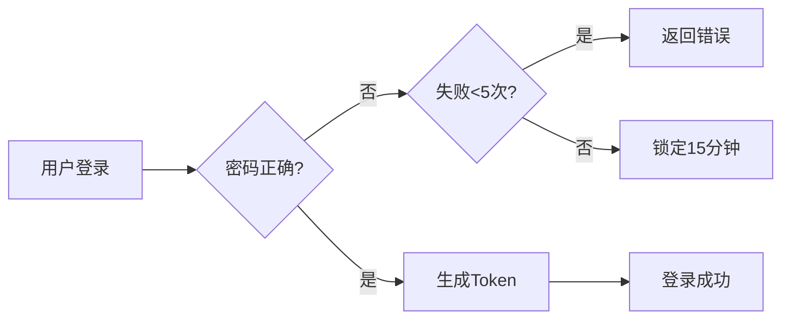
```mermaid
flowchart LR
    A[用户登录] --> B{密码正确?}
    B -->|否| C{失败<5次?}
    C -->|是| D[返回错误]
    C -->|否| E[锁定15分钟]
    B -->|是| F[生成Token]
    F --> G[登录成功]
```

#### 2. 权限控制模型

```mermaid
flowchart LR
    A[访问文档] --> B{登录?}
    B -->|否| C{公开?}
    B -->|是| D{成员?}
    C -->|是| E[允许]
    C -->|否| F[拒绝]
    D -->|是| G{权限检查}
    D -->|否| C
    G --> E
    G --> F

    style E fill:#9f9
    style F fill:#f99
```

#### 3. 安全措施

- 密码用 BCrypt 加密，不存明文
- JWT Token 7 天有效期
- 登录失败 5 次锁定 15 分钟
- 防止 SQL 注入和 XSS 攻击
- 文件上传限制（头像 < 2MB）

### （三）系统可靠性

```mermaid
graph TD
    A[可靠性保障] --> B[数据备份<br/>每天自动备份]
    A --> C[Redis持久化<br/>AOF+RDB]
    A --> D[事务回滚<br/>关键操作]
    A --> E[系统可用性<br/>≥99.5%]
```

### （四）兼容性

- 支持主流浏览器：Chrome、Firefox、Edge、Safari
- 响应式设计，支持桌面和平板
- 支持暗黑模式和浅色模式切换

---

## 五、接口设计

### （一）API 接口

我们使用 RESTful API 风格，所有接口返回统一的 JSON 格式。

```mermaid
graph LR
    A[前端] -->|HTTP请求| B[后端API]
    B -->|JWT验证| C{Token有效?}
    C -->|否| D[返回401错误]
    C -->|是| E[处理业务逻辑]
    E --> F[返回JSON响应]

    style D fill:#f99
    style F fill:#9f9
```

**统一响应格式：**
```json
{
  "code": 200,
  "message": "success",
  "data": {}
}
```

**认证方式：**
- 请求头带上 `Authorization: Bearer <token>`
- Token 有效期 7 天

### （二）WebSocket 接口

用于实时协同编辑。

```mermaid
sequenceDiagram
    participant C as 客户端
    participant W as WebSocket服务器
    participant R as Redis

    C->>W: 连接 /ws/collab
    W->>W: 验证Token
    W->>R: 记录在线状态
    W-->>C: 连接成功

    loop 实时通信
        C->>W: 发送编辑操作
        W->>R: 保存操作
        W->>C: 广播给其他用户
    end

    C->>W: 断开连接
    W->>R: 清除在线状态
```

### （三）外部服务接口

```mermaid
graph TD
    A[Wiki系统] --> B[邮件服务<br/>SMTP]
    A --> C[短信服务<br/>HTTP API]
    A --> D[云存储<br/>可选]

    B -.->|发送验证码| E[用户邮箱]
    C -.->|发送验证码| F[用户手机]
    D -.->|存储文件| G[OSS/S3]

    style B fill:#ff9
    style C fill:#ff9
    style D fill:#ff9
```

**说明：**
- 邮件和短信服务是可选的，没配置的话系统会进入测试模式
- 云存储也是可选的，可以用本地存储代替

---

## 六、数据库设计

### （一）数据库表结构

系统主要有这些表：

```mermaid
graph LR
    A[用户表] --> B[知识库表]
    A --> C[知识库成员表]
    B --> C
    B --> D[文档表]
    D --> E[文档版本表]
    D --> F[文档草稿表]
    D --> G[分享链接表]
    A --> H[操作日志表]
```

**核心表说明：**
- `user_account`：用户账号
- `knowledge_base`：知识库
- `knowledge_base_member`：知识库成员关系
- `wiki_document`：文档
- `document_version`：文档版本历史
- `document_draft`：文档草稿
- `share_link`：分享链接
- `operation_log`：操作日志

**设计要点：**
- 所有表的主键用雪花算法生成（BIGINT 类型）
- 软删除用 `deleted_at` 字段（NULL 表示未删除）
- 时间字段 `created_at`、`updated_at` 自动维护

### （二）Redis 缓存设计

为了提高性能，我们用 Redis 缓存一些常用数据：

```mermaid
graph TD
    A[Redis缓存] --> B[文档HTML缓存<br/>doc:html:docId<br/>1小时]
    A --> C[最近文档列表<br/>doc:recent<br/>10分钟]
    A --> D[热门文档列表<br/>doc:popular<br/>10分钟]
    A --> E[编辑锁<br/>editing:docId<br/>5分钟]
    A --> F[验证码<br/>verify:type:target<br/>5分钟]
    A --> G[频率限制<br/>rate:ip:action<br/>1分钟]

    style B fill:#9f9
    style E fill:#f99
    style F fill:#ff9
    style G fill:#ff9
```

**缓存一致性：**
- 文档更新时删除对应的 HTML 缓存
- 文档删除时清理所有相关缓存
- 用 Redis 事务保证操作的原子性

---

## 七、限制和约束

### （一）技术选型

这些技术是必须用的，不能换：
- 后端：Spring Boot 3 + JPA
- 前端：Vue 3
- 数据库：MySQL 8.0
- 缓存：Redis

### （二）业务规则

```mermaid
graph TD
    A[业务规则] --> B[用户名/邮箱/手机号<br/>全局唯一]
    A --> C[知识库至少<br/>1个管理员]
    A --> D[回收站保留<br/>30天]
    A --> E[验证码有效期<br/>5分钟]
    A --> F[分享链接最长<br/>30天]
```

### （三）开发规范

- 代码风格：参考阿里巴巴 Java 开发规范
- 前端代码：遵循 Vue 官方风格指南
- Git 提交：用 Conventional Commits 格式（比如 `feat: 添加用户注册功能`）
- API 文档：用 Swagger 自动生成

---

## 八、测试和验收

### （一）功能测试

需要测试的完整流程：

```mermaid
graph LR
    A[注册账号] --> B[登录系统]
    B --> C[创建知识库]
    C --> D[邀请成员]
    D --> E[创建文档]
    E --> F[编辑文档]
    F --> G[协同编辑]
    G --> H[查看版本]
    H --> I[搜索文档]
    I --> J[分享文档]
```

### （二）性能测试

- 100 个用户同时在线，API 响应时间要 < 200ms
- 文档加载时间 < 1s
- 协同编辑延迟 < 100ms

### （三）安全测试

- 测试 SQL 注入攻击（应该被拦截）
- 测试 XSS 攻击（应该被过滤）
- 测试未授权访问（应该返回 401 错误）
- 检查密码是否加密存储

### （四）兼容性测试

在这些浏览器上测试：
- Chrome（最新版）
- Firefox（最新版）
- Edge（最新版）

测试暗黑模式和浅色模式切换是否正常。

---

## 九、附录

### （一）错误码表

| 错误码 | 说明 |
|--------|------|
| 1001 | 用户名已存在 |
| 1002 | 邮箱已被注册 |
| 1003 | 手机号已被注册 |
| 1004 | 验证码错误或已过期 |
| 1005 | 用户名或密码错误 |
| 2001 | 知识库不存在 |
| 2002 | 无权限访问该知识库 |
| 3001 | 文档不存在 |
| 3002 | 文档正在被他人编辑 |
| 3003 | 版本不存在 |
| 4001 | 分享链接已失效 |
| 5001 | 频率限制，请稍后再试 |

### （二）参考资料

- 语雀产品：https://www.yuque.com
- Notion 产品：https://www.notion.so

### （三）项目时间线

```mermaid
gantt
    title 项目开发计划
    dateFormat  YYYY-MM-DD
    section 需求阶段
    需求分析           :done, 2026-03-16, 4d
    section 设计阶段
    系统设计           :active, 2026-03-25, 5d
    数据库设计         :active, 2026-03-26, 5d
    section 开发阶段
    后端开发           :2026-04-02, 20d
    前端开发           :2026-04-15, 20d
    section 测试阶段
    功能测试           :2026-04-27, 7d
    性能测试           :2026-04-28, 7d
    section 交付阶段
    提交项目           :2026-05-10, 3d
```

